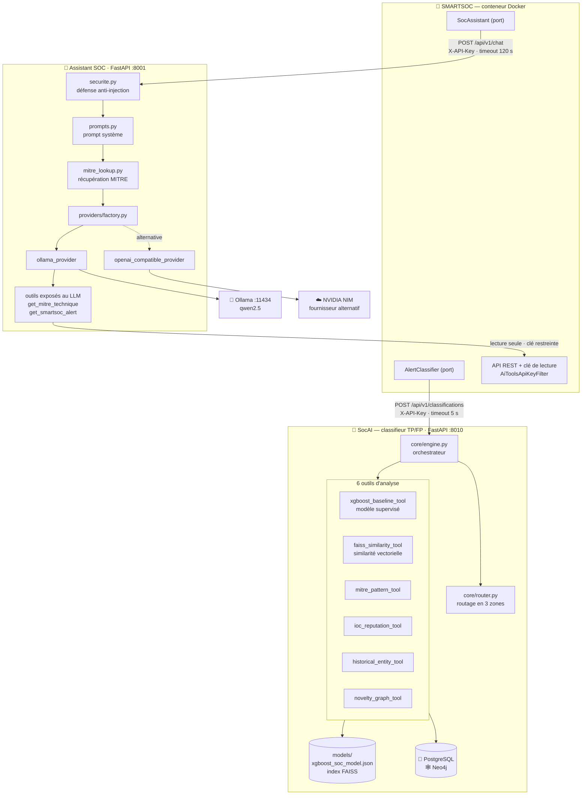
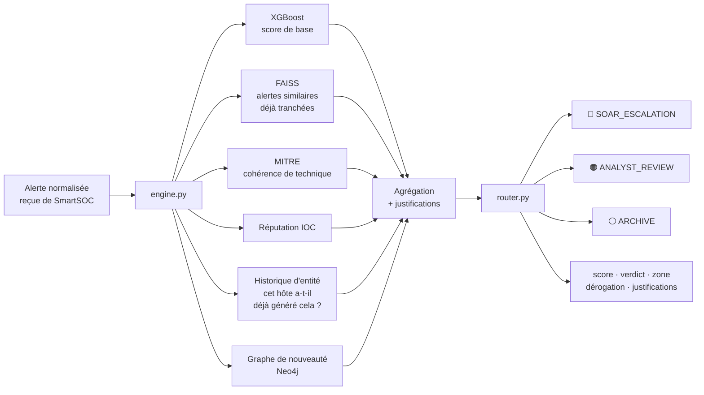
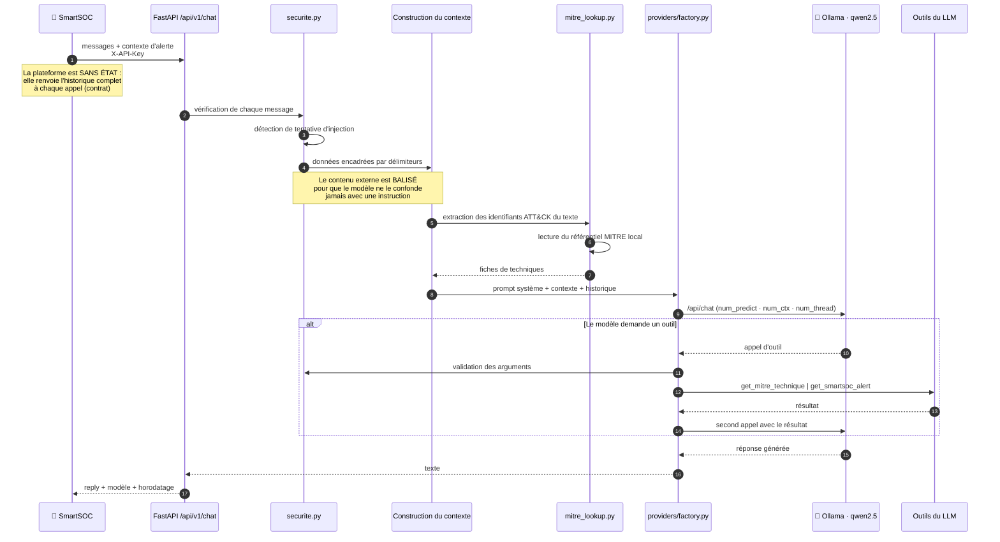
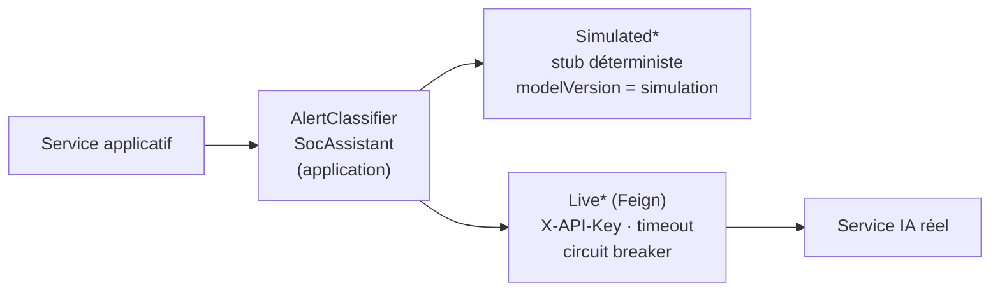

# Architecture des services IA — SmartSOC Enterprise

- **Date** : 2026-08-05
- **Cadre** : [ADR-005](adr/ADR-005-standalone-platform-integration-contracts.md)
  (services IA développés hors dépôt) et
  [ADR-008](adr/ADR-008-ai-integration-architecture.md) (intégration par ports)
- **Source** : inspection du code réel des deux services et mesures effectuées
  sur la machine d'exécution

> **Périmètre de propriété.** Les deux services IA appartiennent à l'équipe IA et
> vivent dans des dépôts distincts. Ce chapitre les documente **du point de vue
> de l'architecture d'ensemble** ; il ne les spécifie pas. La plateforme n'en
> connaît que les contrats OpenAPI publiés.

---

## 1. Vue d'ensemble

Deux services indépendants, deux rôles opposés, un seul patron d'intégration.

| | **SocAI — classifieur** | **Assistant conversationnel** |
| --- | --- | --- |
| Rôle | Décider TP/FP et router l'alerte | Répondre à l'analyste en langage naturel |
| Technologie | ML supervisé + recherche vectorielle | LLM génératif |
| Appelé | **automatiquement** à chaque alerte | **à la demande** de l'analyste |
| Déterminisme | Reproductible | Non déterministe par nature |
| Chemin critique | Non — asynchrone après le webhook | Non — l'analyste attend sciemment |
| Timeout côté plateforme | 5 s | 120 s |
| Contrat | `ai-classifier-api.yaml` v1.1.0 | `ai-assistant-api.yaml` v1.0.1 |

---

## 2. SocAI — le classifieur TP/FP

### 2.1 Architecture interne

FastAPI expose l'endpoint contractuel ; le moteur de triage orchestre six outils
d'analyse indépendants, puis un routeur transforme leur agrégat en décision.

### 2.2 Où vivent réellement les embeddings

**Les embeddings de ce projet sont ici, pas dans l'assistant.** SocAI embarque
`sentence-transformers` et `faiss-cpu` : les alertes passées sont encodées en
vecteurs et indexées, ce qui permet à l'outil de similarité de retrouver des
alertes proches **déjà tranchées** par un analyste et d'en tirer un signal.

C'est une distinction importante, souvent inversée dans les schémas génériques :
la recherche vectorielle sert ici la **classification**, pas la génération de
texte.

### 2.3 Explicabilité

Le service renvoie des **justifications** — la contribution de chaque outil — en
plus du verdict. C'est ce qui a motivé l'extension du contrat en v1.1.0 (zone,
dérogation, justifications) et son affichage dans le tiroir d'alerte : un
analyste doit pouvoir contester une décision automatique, donc la comprendre.

**Le seuil de décision appartient au modèle, pas à la plateforme.** SmartSOC
stocke ce que le service répond sans jamais l'interpréter — le modèle peut être
réentraîné sans toucher une ligne de la plateforme.

### 2.4 Contraintes d'exploitation observées

| Observation | Mesure réelle | Conséquence |
| --- | --- | --- |
| Démarrage à froid | 3 à 4 min après redémarrage de la machine | Import de torch/xgboost/faiss/sentence-transformers puis chargement des modèles. Le lanceur attend la disponibilité réelle plutôt que de supposer le service prêt. |
| Démarrage à chaud | 20 à 30 s | Cache disque du système d'exploitation |
| Dépendances | PostgreSQL + Neo4j propres au service | Bases **disjointes** de celle de la plateforme — ADR-004 préservé |

---

## 3. Assistant conversationnel

### 3.1 Chaîne de traitement d'un message

### 3.2 La nature réelle du RAG

**Ce RAG n'est pas vectoriel.** `mitre_lookup.py` procède par extraction
d'identifiants de technique (expression régulière) puis lecture d'un référentiel
ATT&CK local, construit par `fetch_mitre_attack.py`. Le contexte injecté est
donc **récupéré par identifiant**, pas par similarité sémantique.

C'est un choix défendable pour ce cas d'usage précis : les identifiants ATT&CK
sont normalisés et sans ambiguïté ; une recherche vectorielle ajouterait de la
latence et de l'imprécision là où une correspondance exacte suffit. Sur une
machine sans GPU, l'économie est loin d'être négligeable.

*Formulation exacte à retenir :* le projet comporte **deux mécanismes de
récupération distincts** — vectoriel dans le classifieur (FAISS), par
identifiant dans l'assistant (référentiel MITRE).

### 3.3 Fournisseurs de LLM interchangeables

`providers/factory.py` sélectionne l'implémentation par configuration — même
doctrine que les adaptateurs `simulation`/`live` de la plateforme :

| Fournisseur | Usage | Remarque |
| --- | --- | --- |
| `ollama_provider` | Défaut — modèle local | Aucune donnée ne quitte la machine |
| `openai_compatible_provider` | Alternative NVIDIA NIM | Latence bien moindre, mais les données sortent |
| `fake_provider` | Tests | Déterministe |

### 3.4 Réglages d'inférence et arbitrage mesuré

Mesures réelles sur la machine d'exécution (CPU sans GPU dédié, 12 threads) :

| Modèle | Débit mesuré | Temps de réponse réel via `/api/v1/chat` |
| --- | --- | --- |
| qwen2.5:7b | ~3,1 tokens/s | 26 – 29 s *(après optimisation ; 60 – 90 s avant)* |
| qwen2.5:1.5b | ~13 tokens/s | 22,9 s |

Optimisations appliquées côté service : plafond `num_predict`, fenêtre `num_ctx`
réduite, `num_thread` aligné sur les cœurs logiques, prompt système resserré, et
préchauffage du modèle au démarrage.

**Arbitrage assumé et documenté.** L'objectif de 10-15 s n'est pas atteignable
avec la qualité du 7b sur ce matériel : les deux contraintes sont physiquement
incompatibles. Le modèle actuellement configuré est le 1.5b, avec une qualité de
réponse inférieure constatée sur des cas réels. C'est un choix d'exploitation
réversible par variable d'environnement, pas une décision d'architecture.

### 3.5 Sécurité propre à l'assistant

| Risque | Traitement |
| --- | --- |
| Injection de prompt via une alerte | `securite.py` encadre tout contenu externe par des délimiteurs explicites, pour que le modèle ne puisse pas le confondre avec une instruction |
| Injection via les arguments d'outil | Validation avant exécution (`verifier_tool_arguments`) |
| Fuite d'historique | Le service est **sans état** : la plateforme reste propriétaire des conversations |
| Exposition directe | Le service n'est **jamais** accessible depuis le navigateur : la plateforme le relaie derrière JWT + RBAC |
| Accès de l'IA aux données | Clé d'API **strictement en lecture** (`AiToolsApiKeyFilter`, inactif hors `GET`) — l'outil `get_smartsoc_alert` ne peut rien modifier |

**Défaut réel rencontré et corrigé :** une bulle d'erreur affichée dans la
console était renvoyée au tour suivant comme si elle faisait partie de la
conversation ; le point-virgule de ce texte déclenchait la détection d'injection
et faisait rejeter toute la requête. Les messages en échec sont désormais exclus
de l'historique transmis — ce sont des artefacts d'affichage, jamais du contenu.

---

## 4. Intégration côté plateforme

Les deux services sont derrière des ports, avec deux adaptateurs chacun — la
plateforme démarre, se teste et se démontre **sans qu'aucun service IA ne
tourne**.

**Dégradation gracieuse, vérifiée.** Classifieur injoignable : l'alerte reste
ingérée et triable, sans score, reclassable manuellement. Assistant injoignable :
la console affiche « assistant indisponible » (503 `AI_UNAVAILABLE`), le reste de
la plateforme est intact.

**Deux ajustements de délai issus de mesures réelles**, pas d'estimations :

| Correctif | Avant | Après | Fait déclencheur |
| --- | --- | --- | --- |
| Timeout de l'assistant | 30 s *(estimation de l'ADR-008)* | 120 s | Génération réellement plus longue sur CPU |
| Ping de santé IA | 2 s | 8 s | Le ping relaie vers Ollama : 2,6 à 4,4 s mesurés ; l'assistant était déclaré indisponible à tort |

Le second cas est représentatif de la doctrine du projet : une valeur posée sans
donnée réelle est révisée dès qu'une mesure la contredit — et le correctif est
tracé dans un ADR ou une PR, jamais appliqué en silence.

---

## 5. Ce que la plateforme ne fait délibérément pas

| Non fait | Raison |
| --- | --- |
| Héberger ou entraîner les modèles | Périmètre de l'équipe IA (ADR-005) |
| Interpréter le score pour décider TP/FP | Le seuil appartient au modèle ; la plateforme stocke le verdict explicite |
| Exposer les services IA au navigateur | Ils sont relayés derrière JWT + RBAC |
| Conserver l'historique côté service IA | Le service est sans état ; la plateforme est propriétaire des conversations |
| Rendre l'IA bloquante | Aucun appel IA n'est sur le chemin critique de l'ingestion |
