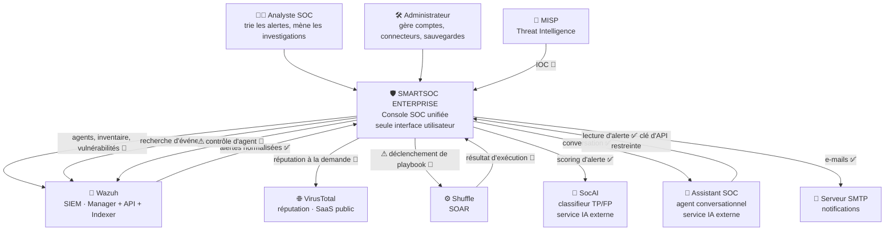
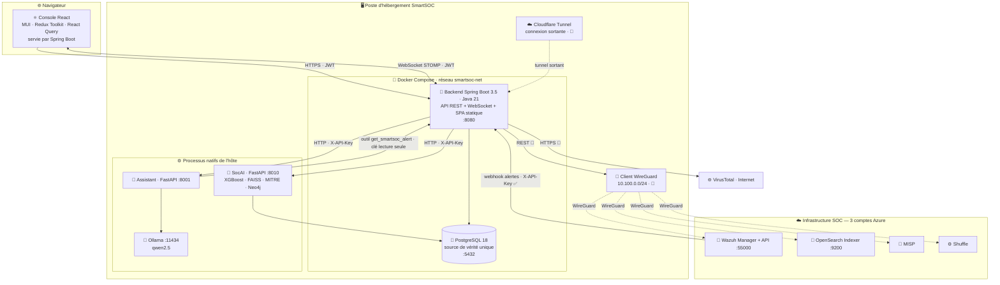
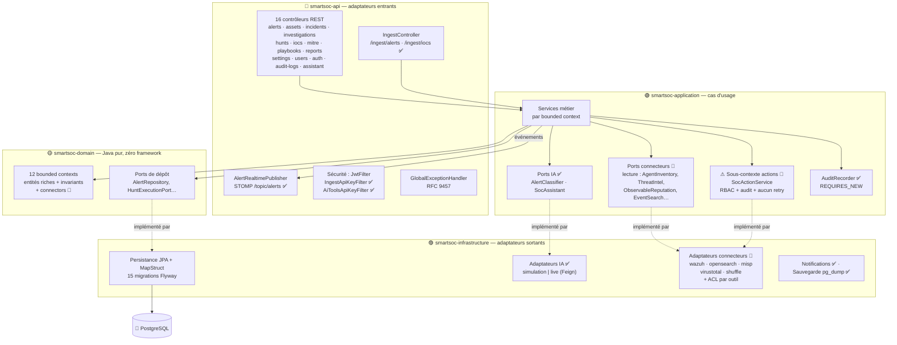

# Modèle C4 — SmartSOC Enterprise

- **Niveau de détail** : Contexte → Conteneurs → Composants → Déploiement
- **Date** : 2026-08-05
- **Convention de lecture** : ✅ existe et fonctionne · 🔨 prévu par la
  [baseline d'intégration](soc-integration-plan.md) · ⚠ effet réel sur des
  machines de production

> Les diagrammes décrivent l'état **réel** du système, pas un état souhaité.
> Ce qui est marqué 🔨 n'existe pas encore et est identifié comme tel.

---

## Niveau 1 — Contexte

Qui utilise SmartSOC, et avec quels systèmes la plateforme dialogue-t-elle.



**Invariants du niveau contexte.**

1. Aucun utilisateur n'atteint un outil SOC directement — c'est l'objectif
   *Gateway*, et il est vérifiable : aucune URL ni jeton d'outil ne descend
   jamais dans le navigateur.
2. Un seul système hors du réseau privé : VirusTotal.
3. L'assistant IA **rappelle** SmartSOC via une clé d'API **strictement en
   lecture** (filtre inactif hors `GET`) — il n'a aucun compte analyste.

---

## Niveau 2 — Conteneurs

Les unités déployables et leurs protocoles.



**Points remarquables, tous vérifiés.**

- **Un seul conteneur applicatif.** Spring Boot sert l'API *et* le build React
  statique (ADR-007) : pas de Nginx, pas de second port, pas de CORS.
- **Les services IA ne sont pas conteneurisés.** Ils tournent en processus natifs
  sur l'hôte, avec Ollama. Le backend, lui, est en conteneur : il les joint via
  `host.docker.internal`, ce qui impose que les services IA écoutent sur
  `0.0.0.0` et non `127.0.0.1`.
- **Cloudflare Tunnel établit une connexion sortante** : aucun port entrant
  n'est ouvert sur le poste.
- **Le backend est le seul écrivain en base** (ADR-004). SocAI possède sa propre
  base, disjointe de celle de la plateforme.

---

## Niveau 3 — Composants du backend

Découpage interne du conteneur Spring Boot, conforme à l'ADR-002 et vérifié par
ArchUnit à chaque build.



**Règles vérifiées par machine** (`CleanArchitectureTest`, ArchUnit) :

- le domaine ne dépend d'**aucun** framework ;
- `Api` et `Infrastructure` ne sont accessibles depuis aucune autre couche ;
- `Application` n'est accessible que depuis `Api` et `Infrastructure`.

**Règle à ajouter en phase 5** : aucune classe hors de
`application.connectors.actions` ne peut dépendre d'un port d'action — l'audit
des actions à effet réel devient impossible à contourner.

---

## Niveau 4 — Déploiement

Topologie physique réelle. Trois comptes Azure distincts reliés par WireGuard en
Hub-and-Spoke ; SmartSOC s'exécute **hors Azure**, sur le poste de
développement, et se connecte en sortant.

```mermaid
flowchart TB
    INTERNET["🌍 Internet"]
    ANALYST["👩‍💻 Analystes SOC"]

    subgraph POSTE["🖥️ POSTE D'HÉBERGEMENT SMARTSOC — hors Azure"]
        subgraph DK["🐳 Docker Compose · bridge smartsoc-net"]
            BE["🍃 smartsoc-backend<br/>Spring Boot · JRE 21 Alpine<br/>non-root · healthcheck<br/>:8080"]
            DB[("🐘 postgres:18<br/>volume persistant")]
        end
        AI1["🧠 SocAI :8010<br/>FastAPI · XGBoost · FAISS<br/>sentence-transformers"]
        AI2["💬 Assistant :8001<br/>FastAPI"]
        OL["🦙 Ollama :11434"]
        AIDB[("🐘🕸️ Postgres + Neo4j<br/>bases propres à SocAI")]
        CFC["☁️ cloudflared<br/>tunnel sortant 🔨"]
        WGC["🔐 WireGuard client 🔨<br/>peer du hub"]
    end

    subgraph AZ1["☁️ COMPTE AZURE 1 — SIEM central · VNet 10.10.0.0/16"]
        WGH["🔐 WireGuard HUB · 10.100.0.1<br/>UDP 51820"]
        WZ["🐺 Wazuh Manager · API :55000<br/>Dashboard :5601"]
        OSI["🔎 OpenSearch Indexer :9200"]
    end

    subgraph AZ2["☁️ COMPTE AZURE 2 — Détection · VNet 10.20.0.0/16"]
        WGS2["🔐 spoke · 10.100.0.2"]
        UBU["🐧 Ubuntu · Suricata · Zeek · auditd · YARA"]
        WSRV["🖥️ Windows Server · IIS · Sysmon · 10.100.0.5"]
        W10["💻 Windows 10 · Sysmon · 10.100.0.9"]
    end

    subgraph AZ3["☁️ COMPTE AZURE 3 — CTI / SOAR / Offensif · VNet 10.30.0.0/16"]
        WGS3["🔐 spoke · 10.100.0.3"]
        MI["🧬 MISP + intégration VirusTotal"]
        SH["⚙️ Shuffle SOAR · 10.100.0.4"]
        KALI["🗡️ Kali · Atomic Red Team · 10.100.0.7"]
    end

    VTC["🌐 VirusTotal · API publique"]

    ANALYST --> INTERNET
    INTERNET -->|"HTTPS 443"| CFC
    CFC -.->|"tunnel sortant · aucun port entrant"| BE
    BE --> DB
    BE -->|"host.docker.internal"| AI1
    BE -->|"host.docker.internal"| AI2
    AI2 --> OL
    AI1 --> AIDB

    KALI -->|"attaques simulées"| UBU
    KALI --> WSRV
    KALI --> W10
    UBU -->|"agents · 1514/udp"| WZ
    WSRV --> WZ
    W10 --> WZ
    WZ --> OSI

    WGC -.WireGuard 10.100.0.0/24.-> WGH
    WGS2 -.-> WGH
    WGS3 -.-> WGH
    WZ -->|"webhook alertes ✅"| CFC
    SH -->|"webhook ✅"| CFC
    BE -->|"REST via WireGuard 🔨"| WGC
    BE -->|"HTTPS Internet 🔨"| VTC
    MI -.-> VTC
```

**Trois caractéristiques de sécurité de cette topologie.**

1. **Aucun port entrant** sur le poste d'hébergement : Cloudflare Tunnel
   n'établit que des connexions sortantes.
2. **Aucun outil SOC exposé sur Internet** : ils ne sont joignables que par
   l'overlay WireGuard.
3. **Deux chemins entrants seulement** vers SmartSOC — Wazuh et Shuffle — tous
   deux authentifiés par clé d'API sur le même endpoint d'ingestion.

**Fragilités connues, assumées à ce stade du projet.**

- SmartSOC est hébergé sur un poste de développement : pas de haute
  disponibilité, disponibilité liée à celle du poste.
- Les services IA ne sont pas conteneurisés : leur démarrage est manuel
  (script de lancement), et un redémarrage du poste les arrête.
- Une VM Azure éteinte pour raison de coût coupe le flux correspondant — d'où
  l'importance de la dégradation gracieuse, traitée en §8 de la baseline.

---

## Index des vues complémentaires

| Vue | Document |
| --- | --- |
| Décisions d'architecture d'intégration | [`soc-integration-plan.md`](soc-integration-plan.md) · [ADR-014](adr/ADR-014-soc-integration-architecture.md) |
| Relations entre bounded contexts | [`CONTEXT-MAP.md`](CONTEXT-MAP.md) |
| Événements de domaine | [`DOMAIN-EVENTS.md`](DOMAIN-EVENTS.md) |
| Scénarios dynamiques | [`SEQUENCE-DIAGRAMS.md`](SEQUENCE-DIAGRAMS.md) |
| Architecture des services IA | [`AI-ARCHITECTURE.md`](AI-ARCHITECTURE.md) |
| Moteur SOAR | [`SOAR-ARCHITECTURE.md`](SOAR-ARCHITECTURE.md) |
| Référence des connecteurs | [`CONNECTORS-REFERENCE.md`](CONNECTORS-REFERENCE.md) |
| Planification | [`PROJECT-PLANNING.md`](PROJECT-PLANNING.md) |
