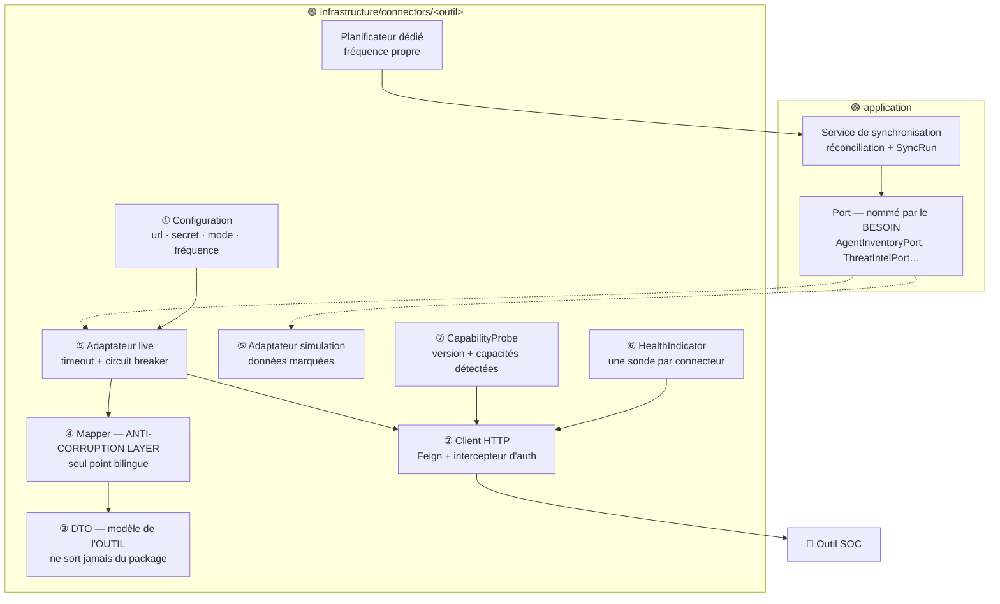

# Référence des connecteurs SOC — SmartSOC Enterprise

- **Date** : 2026-08-05
- **Cadre** : [ADR-014](adr/ADR-014-soc-integration-architecture.md) et
  [baseline d'intégration](soc-integration-plan.md)
- **État** : 🔨 aucun connecteur n'est implémenté — ce document est la
  **spécification de référence** de la phase d'intégration

---

## 1. Anatomie d'un connecteur

Tout connecteur est composé des mêmes sept éléments. Cette uniformité est ce qui
rend le socle réutilisable et le comportement prévisible.



| # | Élément | Règle |
| --- | --- | --- |
| ① | Configuration | Variables d'environnement uniquement. Aucun secret en base ni en Git. |
| ② | Client HTTP | Feign + Resilience4j. Pas de WebClient : la plateforme est un socle servlet pur *(voir l'amendement de l'ADR-014)*. |
| ③ | DTO | Le modèle de l'outil, tel qu'il est vraiment. **Ne sort jamais de son package.** |
| ④ | ACL | Seul endroit du projet connaissant les deux vocabulaires. Un changement de format n'impacte qu'un fichier. |
| ⑤ | Adaptateurs | **Toujours deux.** `simulation` par défaut, pour que la plateforme démarre sans SOC. |
| ⑥ | HealthIndicator | Un par connecteur — Spring Boot les agrège nativement. |
| ⑦ | CapabilityProbe | Détecte la version réelle et en déduit les capacités. |

---

## 2. Tableau de bord — les 8 dimensions par connecteur

Ce que la section « Connecteurs » du module Paramètres devra afficher pour
chaque outil.

| Dimension | Source | Exemple de rendu |
| --- | --- | --- |
| **Mode** | Configuration | `simulation` · `live` · `disabled` |
| **État** | `SocConnector` | `CONNECTED` · `DEGRADED` · `DISCONNECTED` · `NOT_CONFIGURED` · `DISABLED` |
| **Santé** | `HealthIndicator` | Dernière sonde, résultat, horodatage |
| **Version détectée** | `CapabilityProbe` | « Wazuh 4.x » — détectée, jamais supposée |
| **Capacités** | `ConnectorDescriptor` | Liste des capacités disponibles, et celles **déclarées indisponibles** |
| **Authentification** | Configuration | Type et statut « configuré / non configuré » — **jamais la valeur** |
| **Métriques** | Micrometer | Volume d'appels, taux d'erreur, dernière synchronisation |
| **Latence** | Micrometer | p50 / p95 / p99 des appels sortants |

### Maquette de la vue

```
┌──────────────────────────────────────────────────────────────────────┐
│ 🐺 WAZUH                                    ● CONNECTED     [live]   │
├──────────────────────────────────────────────────────────────────────┤
│ Version détectée   4.x (détectée le 05/08 14:32)                     │
│ Authentification   JWT Wazuh · ✅ configuré                           │
│ Santé              OK · dernière sonde il y a 12 s                    │
│ Dernière sync      il y a 3 min · 47 agents · 0 rejet                 │
│ Latence            p50 120 ms · p95 340 ms · p99 890 ms               │
│ Appels (1 h)       312 · taux d'erreur 0,3 %                          │
│                                                                       │
│ Capacités          ✅ Inventaire d'agents    ✅ Inventaire système     │
│                    ✅ Statistiques           ⚠ Vulnérabilités :       │
│                                                 via l'Indexer          │
│                    ⛔ Contrôle d'agent (phase 5)                      │
└──────────────────────────────────────────────────────────────────────┘
```

**Règle d'affichage :** une capacité indisponible est **annoncée avec son
motif**, jamais silencieusement absente — même doctrine que les sections
« à venir » du module Paramètres.

---

## 3. Fiches par connecteur

### 3.1 🐺 Wazuh — API de gestion

| | |
| --- | --- |
| **Adresse** | `10.100.0.1:55000` · WireGuard |
| **Authentification** | JWT Wazuh (obtenu puis rafraîchi par intercepteur) |
| **Ports servis** | `AgentInventoryPort`, `SystemInventoryPort`, `ManagerStatsPort`, `VulnerabilityFeedPort`, `AgentControlPort` ⚠ |
| **Alimente** | Module Actifs, section Connecteurs, module Vulnérabilités |
| **Fréquence** | ~5 min (agents et inventaire) |
| **Phase** | 1.2 (lecture) · 1.3 (vulnérabilités) · 5 (contrôle ⚠) |
| **Dégradation** | Actifs consultables, date de dernière synchronisation affichée |

**Contrainte majeure** — l'API Wazuh est une **API de gestion** : elle n'expose
aucun endpoint de consultation d'alertes. Les alertes arrivent par le webhook
(phase 1.1) ou par l'Indexer (phase 4).

**Point de vigilance sur les capacités** — l'origine des données de vulnérabilité
dépend de la version déployée. C'est le cas d'usage qui justifie à lui seul le
`CapabilityProbe`.

### 3.2 🔎 OpenSearch — recherche d'événements

| | |
| --- | --- |
| **Adresse** | `10.100.0.1:9200` · WireGuard |
| **Authentification** | Identifiants OpenSearch |
| **Port servi** | `EventSearchPort` — second adaptateur du `HuntExecutionPort` **existant** |
| **Alimente** | Module Threat Hunting *(déjà construit — aucun frontend à écrire)* |
| **Déclenchement** | À la demande (exécution d'une chasse) |
| **Phase** | 4 |
| **Dégradation** | « Chasse indisponible — OpenSearch injoignable depuis HH:MM » ; le mode simulation reste utilisable |

**Périmètre borné** : 8 `HuntField` × 3 opérateurs à projeter sur les champs
d'index. Testable exhaustivement, pas un langage arbitraire.

**Dépendance dure** : le mapping exige un schéma d'index **réel**, produit par
plusieurs jours d'indexation (phase 1.1).

### 3.3 🧬 MISP — Threat Intelligence

| | |
| --- | --- |
| **Adresse** | `10.100.0.3` · WireGuard |
| **Authentification** | Clé d'API MISP |
| **Port servi** | `ThreatIntelPort` |
| **Alimente** | Modèle `Indicator` **existant** — MISP l'alimente, ne le remplace pas |
| **Fréquence** | ~30 min, en pull programmé |
| **Phase** | 2 |
| **Dégradation** | Fond CTI figé ; la corrélation locale continue de fonctionner |

**Aucune modification du domaine** : `feedSource` et `externalId` existent déjà
sur `Indicator`, et `IndicatorFeedIngestionService` (tolérant par élément) est
réutilisé tel quel.

**Pull plutôt que push** : le contrat de push existe (`/api/v1/ingest/iocs`),
mais tirer donne la maîtrise du rythme et évite qu'un import massif côté MISP ne
sature la plateforme.

### 3.4 🌐 VirusTotal — réputation d'observables

| | |
| --- | --- |
| **Adresse** | `virustotal.com` · **Internet, hors WireGuard** |
| **Authentification** | Clé d'API VirusTotal |
| **Port servi** | `ObservableReputationPort` |
| **Déclenchement** | **Clic de l'analyste uniquement** — jamais sur le flux |
| **Phase** | 3 |
| **Dégradation** | Cache servi si disponible, sinon message explicite |

**Deux contraintes propres à ce connecteur :**

- **Quota strict** (4 requêtes/min, 500/jour en offre gratuite). Cache persistant
  **obligatoire** + `@RateLimiter` Resilience4j qui refuse **avant** d'appeler,
  pour ne jamais faire bloquer le compte.
- **Couverture partielle** : 7 des 8 `IndicatorType` sont supportés —
  VirusTotal **n'analyse pas les adresses e-mail**. Le bouton est masqué pour ce
  type plutôt que d'échouer.

*Rappel de la décision (option C) :* MISP fournit le fond CTI, VirusTotal sert
les consultations ponctuelles.

### 3.5 ⚙️ Shuffle — SOAR ⚠

| | |
| --- | --- |
| **Adresse** | `10.100.0.4` · WireGuard |
| **Authentification** | Clé d'API Shuffle (sortant) + 3ᵉ clé d'ingestion (callback entrant) |
| **Ports servis** | `WorkflowTriggerPort` ⚠, `WorkflowStatusPort` (lecture, pour la réconciliation) |
| **Déclenchement** | **Manuel par un analyste** en V1 |
| **Phase** | 5 |
| **Dégradation** | Exécution non démarrée, tracée en échec, **aucun retry** |

Seul connecteur **bidirectionnel** : la plateforme déclenche, Shuffle rappelle
via le webhook. Voir [`SOAR-ARCHITECTURE.md`](SOAR-ARCHITECTURE.md).

---

## 4. Matrice de synthèse

| Connecteur | Sens | Réseau | Déclenchement | Effet réel | Phase | Cache |
| --- | --- | --- | --- | --- | --- | --- |
| Wazuh (lecture) | sortant | WireGuard | programmé | non | 1.2 / 1.3 | non — PostgreSQL suffit |
| Wazuh (contrôle) ⚠ | sortant | WireGuard | clic analyste | **oui** | 5 | sans objet |
| OpenSearch | sortant | WireGuard | à la demande | non | 4 | non |
| MISP | sortant | WireGuard | programmé | non | 2 | utile |
| VirusTotal | sortant | **Internet** | clic analyste | non | 3 | **obligatoire** |
| Shuffle (déclenchement) ⚠ | sortant | WireGuard | clic analyste | **oui** | 5 | sans objet |
| Shuffle (callback) | **entrant** | WireGuard | fin de workflow | non | 5 | sans objet |

---

## 5. Règles transverses

**Résilience** — timeouts différenciés (santé 3 s · lecture 10 s · recherche
30 s · action 15 s), valeurs **mesurées en réel puis ajustées**, jamais figées
sur une estimation. Circuit breaker par connecteur, isolé. Retry sur les lectures
idempotentes uniquement, **jamais** sur une action.

**Sécurité** — un jeu de secrets par connecteur, en variables d'environnement.
TLS vérifié y compris en interne : WireGuard chiffre le transport mais ne dit pas
*à qui* on parle. Aucune URL ni jeton d'outil ne descend dans le navigateur.

**Observabilité** — un `HealthIndicator` et un `SyncRun` par connecteur ; log
structuré nommant le connecteur et l'opération, **jamais** le secret ni l'URL
complète.

**Tests** — l'ACL de chaque connecteur est testée sur des **échantillons réels
capturés en phase 0** ; les adaptateurs `live` sont testés contre WireMock, y
compris leurs chemins d'erreur (500, 401, timeout). Les vrais outils ne sont
jamais appelés par la CI : la vérification réelle est manuelle, en fin de phase,
et consignée dans le journal de bord.

---

## 6. Ajouter un nouveau connecteur

Grâce au socle, la procédure est mécanique — c'est la mesure du succès de cette
architecture :

1. Définir le **port** dans `application/connectors/ports`, nommé d'après le
   besoin (jamais d'après l'outil).
2. Créer le package d'infrastructure avec ses sept éléments (§1).
3. Écrire l'**ACL** et le tester sur des échantillons réels.
4. Enregistrer le type dans `ConnectorType` et brancher la fiche dans la console.
5. **Aucun fichier existant n'est modifié** — planificateur, sonde de santé et
   configuration sont propres au nouveau connecteur.

C'est précisément ce que garantissent les décisions « un planificateur par
connecteur » et « une sonde par connecteur » de l'amendement v1.1.
