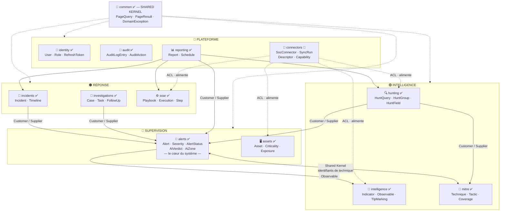

# Context Map DDD — SmartSOC Enterprise

- **Date** : 2026-08-05
- **Méthode** : relations **mesurées** dans le code (analyse des dépendances
  entre packages du module `smartsoc-domain`), pas déduites de l'intention
- **Convention** : ✅ existe · 🔨 prévu par la [baseline d'intégration](soc-integration-plan.md)

---

## 1. Carte des contextes



---

## 2. Relations mesurées

Dépendances réellement présentes dans `smartsoc-domain` (hors `common`) :

| Contexte amont | dépend de | Motif |
| --- | --- | --- |
| `alerts` | `intelligence`, `mitre` | Une alerte porte des observables et des techniques ATT&CK |
| `hunting` | `alerts`, `mitre` | La chasse s'exprime sur le modèle d'alerte |
| `incidents` | `alerts` | Un incident regroupe des alertes |
| `investigations` | `alerts` | Un dossier regroupe alertes **et** incidents |
| `mitre` | `alerts` | Le calcul de couverture s'appuie sur les alertes observées |
| `reporting` | `alerts`, `hunting`, `incidents`, `soar` | Un rapport agrège les modules opérationnels |

**Sans aucune dépendance sortante** : `assets`, `audit`, `identity`,
`intelligence`, `soar`. Ce sont des contextes autoportants — propriété
souhaitable, et c'est ce qui rend `assets` et `intelligence` faciles à alimenter
par des connecteurs sans risque de propagation.

---

## 3. Patterns de relation, au sens du DDD stratégique

| Pattern | Où il s'applique | Ce qu'il implique |
| --- | --- | --- |
| **Shared Kernel** | `common` pour tous ; `Observable` entre `alerts` et `intelligence` ; identifiants de technique entre `alerts` et `mitre` | Noyau **volontairement minuscule** : pagination, exception de base, deux types-valeurs. Toute modification engage tous les contextes — c'est pourquoi il reste réduit. |
| **Customer / Supplier** | `alerts` fournit `incidents`, `investigations`, `hunting`, `reporting` | `alerts` est l'amont ; les avals s'adaptent à son modèle. Un changement dans `alerts` se propage — d'où les extensions **additives** (`applyAiEnrichment` séparé de `applyAiAssessment`). |
| **Anticorruption Layer** | `connectors` 🔨 vers Wazuh, OpenSearch, MISP, VirusTotal, Shuffle | Les modèles externes sont traduits à la frontière et n'entrent jamais dans le domaine. |
| **Open Host Service** | `POST /api/v1/ingest/alerts` et `/ingest/iocs` ✅ | Un service d'entrée unique, stable et documenté, ouvert à tout producteur externe. |
| **Published Language** | Les contrats de `docs/integration/` ✅ | Les deux specifications OpenAPI IA et les deux contrats d'ingestion, versionnés en semver, sont le langage commun entre équipes. |
| **Conformist** | *(aucun)* | La plateforme ne se conforme jamais au modèle d'un outil externe — c'est exactement ce que l'ACL évite. |

---

## 4. La relation bidirectionnelle `alerts ↔ mitre`

C'est la seule relation à double sens de la carte, et elle mérite d'être
explicitée plutôt que dissimulée.

- `alerts → mitre` : une alerte porte des identifiants de technique ATT&CK.
- `mitre → alerts` : le calcul de couverture ATT&CK observe les alertes réelles.

Ce cycle est **acceptable** parce qu'il ne porte que sur des **types-valeurs
immuables** (des identifiants de technique), jamais sur un comportement ni sur
un agrégat. Il traduit une réalité du métier : la matrice ATT&CK et les alertes
se décrivent mutuellement.

**Garde-fou à respecter :** si l'un des deux contextes devait un jour appeler un
*service* de l'autre plutôt que d'en lire un type-valeur, le cycle deviendrait
un vrai couplage. Il faudrait alors extraire le vocabulaire partagé dans le
Shared Kernel. À surveiller à chaque évolution de ces deux contextes.

---

## 5. Position du contexte `connectors` 🔨

`connectors` n'est **amont d'aucun contexte métier** : il ne fournit pas de type
que d'autres consommeraient. Il **alimente** des contextes existants par des
services applicatifs, en traduisant du modèle externe vers leur modèle à eux.

```
Outil externe ──► [ACL du connecteur] ──► modèle du contexte cible ──► PostgreSQL
                        ▲
                  seul point du système
                  qui parle les deux langues
```

Conséquence directe : ajouter un connecteur **n'ajoute aucune dépendance** entre
contextes métier. La carte des relations mesurées ci-dessus reste inchangée après
l'intégration complète — c'est la vérification que le découplage est réel et pas
seulement affiché.

---

## 6. Contextes hors du domaine SmartSOC

Systèmes possédés par d'autres équipes, intégrés par contrat (ADR-005) :

| Contexte externe | Propriétaire | Relation | Contrat |
| --- | --- | --- | --- |
| Classifieur TP/FP (SocAI) | Équipe IA | ACL + Published Language | `ai-classifier-api.yaml` v1.1.0 |
| Assistant conversationnel | Équipe IA | ACL + Published Language | `ai-assistant-api.yaml` v1.0.1 |
| Wazuh, OpenSearch, MISP, Shuffle | Équipe SOC | ACL 🔨 | Contrats d'ingestion publiés |
| VirusTotal | Éditeur tiers | ACL 🔨 | API publique, hors de notre contrôle |

Pour les trois premiers, la plateforme **définit** le contrat ; pour VirusTotal,
elle le **subit** — d'où le soin particulier apporté à l'isolation de ce
connecteur (cache, limiteur de débit, capacité déclarée).
