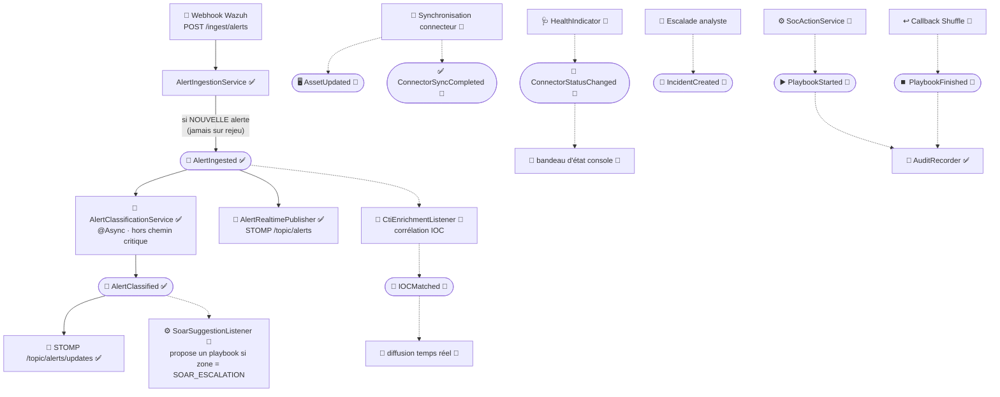

# Architecture événementielle interne — SmartSOC Enterprise

- **Date** : 2026-08-05
- **Convention** : ✅ implémenté et vérifié · 🔨 proposé, non implémenté

> **Deux événements existent aujourd'hui**, `AlertIngestedEvent` et
> `AlertClassifiedEvent`. Les sept autres décrits ici sont des **propositions**
> alignées sur la baseline. Ce document ne prétend pas décrire un système en
> place : il fixe le vocabulaire et les règles avant que les autres n'existent.

---

## 1. Pourquoi des événements internes

L'événement applicatif est **ce qui rend l'intégration additive**. Sans lui,
chaque nouvelle réaction à une alerte (scoring IA, diffusion temps réel,
enrichissement CTI, proposition SOAR) modifierait le service d'ingestion. Avec
lui, elle s'abonne.

Le cas est déjà démontré dans le code : `AlertIngestionService` publie
`AlertIngestedEvent` et **ignore** qui l'écoute. Deux abonnés existent déjà — la
classification IA et la diffusion WebSocket — et l'ingestion n'a jamais été
modifiée pour les accueillir.

**Portée volontairement limitée.** Ces événements sont **in-process** (Spring
`ApplicationEventPublisher`), pas un bus distribué. Aucun Kafka, aucun RabbitMQ :
le besoin réel est le découplage interne, et un broker ajouterait de
l'exploitation sans résoudre un problème existant. Le jour où un consommateur
externe devrait s'abonner, la décision fera l'objet d'un ADR.

---

## 2. Flux événementiel

---

## 3. Catalogue des événements

| Événement | État | Émetteur | Charge utile | Abonnés | Règle métier |
| --- | --- | --- | --- | --- | --- |
| **AlertIngested** | ✅ | `AlertIngestionService` | l'`Alert` persistée | classification IA, diffusion STOMP, *(enrichissement CTI 🔨)* | Émis **uniquement à la création** — un rejeu idempotent ne republie rien, sinon chaque retry de Wazuh reclasserait l'alerte |
| **AlertClassified** | ✅ | `AlertClassificationService` | l'`Alert` scorée | STOMP `/topic/alerts/updates`, *(suggestion SOAR 🔨)* | Topic distinct de l'ingestion : `/topic/alerts` garde la sémantique « nouvelle alerte » |
| **IOCMatched** | 🔨 | Écouteur d'enrichissement CTI | alerte + indicateurs correspondants | diffusion temps réel, journal | Ne modifie **jamais** l'alerte : la corrélation reste calculée à la demande (ADR-009) |
| **AssetUpdated** | 🔨 | Service de synchronisation d'agents | actif + champs modifiés | diffusion temps réel | Émis seulement en cas de **changement réel**, jamais à chaque cycle de synchronisation |
| **IncidentCreated** | 🔨 | `IncidentService` | incident + origine | diffusion temps réel, notifications | Porte l'origine (manuelle ou escalade d'alerte) |
| **PlaybookStarted** ⚠ | 🔨 | `SocActionService` | exécution + acteur + cible | audit, diffusion temps réel | **Toujours** audité nominativement — action à effet réel |
| **PlaybookFinished** ⚠ | 🔨 | Callback Shuffle | exécution + résultat | audit, diffusion, notifications | Un échec est un résultat : il est publié comme les autres |
| **ConnectorStatusChanged** | 🔨 | `HealthIndicator` de connecteur | connecteur + ancien/nouvel état | bandeau console, journal | Émis **sur transition seulement**, jamais à chaque sonde — sinon le flux serait ininterrompu |
| **ConnectorSyncCompleted** | 🔨 | Tâche de synchronisation | `SyncRun` (traités, rejetés, durée) | section Connecteurs, métriques | Publié aussi en cas d'échec partiel : un lot à moitié ingéré doit être visible |

---

## 4. Cinq règles de conception

**1 · Un événement décrit un fait passé, jamais une intention.**
`AlertIngested`, pas `IngestAlert`. Le nom est au participe passé, et l'émetteur
n'attend rien en retour. Un événement qui exige une réponse est un appel de
service déguisé.

**2 · L'émetteur ignore ses abonnés.** `AlertIngestionService` ne connaît ni la
classification IA ni le WebSocket. C'est ce qui permet à la phase
d'enrichissement CTI de s'ajouter sans toucher à l'ingestion.

**3 · Aucun abonné ne bloque le chemin critique.** La classification IA est
`@Async` : le webhook répond à Wazuh **avant** que le score existe. Tout nouvel
abonné coûteux devra respecter cette règle, sous peine de rallonger le temps de
réponse perçu par le SIEM.

**4 · L'échec d'un abonné n'annule pas le fait.** Une classification qui échoue
laisse l'alerte ingérée et exploitable. C'est la doctrine appliquée depuis le
début et qui s'étend aux connecteurs.

**5 · Les événements d'action à effet réel sont toujours audités.**
`PlaybookStarted` et `PlaybookFinished` passent par `AuditRecorder`, dont la
propagation `REQUIRES_NEW` garantit que la trace survit même si la transaction
appelante échoue.

---

## 5. Distinction à ne pas confondre

Trois notions différentes coexistent dans le code et portent des noms voisins :

| Notion | Exemple | Nature |
| --- | --- | --- |
| **Événement applicatif** | `AlertIngestedEvent` | Objet Spring publié en mémoire, déclenche des réactions |
| **Type d'entrée de chronologie** | `IncidentEventType`, `CaseEventType` | Valeur **persistée** décrivant l'historique d'un agrégat, lue par l'analyste |
| **Entrée de journal d'audit** | `AuditAction` | Trace **persistée** de sécurité : qui a fait quoi, depuis quelle IP |

Elles ne se remplacent pas. Un même fait peut produire les trois : une action
SOAR publie un événement applicatif, écrit une entrée de chronologie d'incident,
et enregistre une entrée d'audit.

---

## 6. Ce qui n'est pas prévu, et pourquoi

| Écarté | Raison |
| --- | --- |
| Bus de messages (Kafka, RabbitMQ) | Aucun consommateur hors du processus. Ajouterait de l'exploitation sans résoudre de problème réel. |
| Event Sourcing | Le journal d'audit et les chronologies d'incident couvrent déjà le besoin de traçabilité, à un coût bien moindre. |
| Persistance des événements applicatifs | Ils sont transitoires par nature. Ce qui doit survivre est déjà persisté : `SyncRun`, `AuditLogEntry`, chronologies. |
