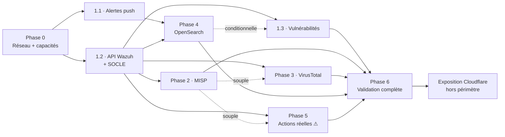

# Planification du chantier d'intégration SOC

- **Document de gestion de projet** — les décisions d'architecture sont dans
  [`soc-integration-plan.md`](soc-integration-plan.md) et l'[ADR-014](adr/ADR-014-soc-integration-architecture.md)
- **Date** : 2026-08-05
- **Nature** : document **vivant** — il évolue au fil de l'avancement, contrairement
  à la baseline d'architecture qui est figée

---

## 1. Estimation de charge

**Base de calibration : les PR réellement livrées sur ce dépôt**, mesurées par
`git show --stat`. Aucune estimation abstraite.

| Référence livrée | Fichiers | Lignes | Ce que cela représente |
| --- | --- | --- | --- |
| PR #44 — classifieur IA `live` | 26 | 1 120 | **L'analogue exact d'un connecteur** : port, 2 adaptateurs, client Feign, circuit breaker, tests WireMock |
| PR #73 — assistant IA `live` | 22 | 827 | Idem, second exemplaire |
| Module métier backend *(6 mesurés)* | 26 – 47 | 1 487 – 3 018 | Domaine + migration + persistance + service + API + tests |
| Module métier frontend *(6 mesurés)* | 6 – 19 | 938 – 1 828 | Écran complet + client d'API + tests |
| PR #79 — extension de contrat | 16 | 305 | Ajout additif à un module existant |

**Unité retenue : le « connecteur-équivalent » (CÉ)** = 1 PR de type #44/#73,
soit ~25 fichiers / ~1 000 lignes backend.

| Phase | Charge | Décomposition | Confiance |
| --- | --- | --- | --- |
| **0** — Réseau + capacités | **0,2 CÉ** | Aucun code livré ; sondes, capture d'échantillons, ADR-015 | **Élevée** |
| **1.1** — Alertes push | **0,2 CÉ** | Zéro code plateforme ; configuration Wazuh + vérification E2E | **Élevée** |
| **1.2** — API Wazuh + socle | **2,5 CÉ** | Socle (contexte `connectors` + persistance + planification + santé ≈ 1 module) + connecteur Wazuh + extension `Asset` + section frontend | Moyenne — socle neuf, non calibré |
| **1.3** — Vulnérabilités | **2,5 CÉ** | Module métier backend complet (1,5) + écran (1) | Moyenne |
| **2** — MISP | **1 CÉ** | Connecteur pur ; **aucune** modification du domaine | **Élevée** — cas nominal |
| **3** — VirusTotal | **1,3 CÉ** | Connecteur + cache + limiteur de débit + panneau frontend | Moyenne |
| **4** — OpenSearch | **1,3 CÉ** | Connecteur + `QueryBuilder` ; **zéro frontend** (écran Hunting existant) | Moyenne — dépend du schéma réel |
| **5** — Actions réelles | **2 CÉ** | 2 connecteurs + sous-contexte `actions` + 3ᵉ filtre de clé + confirmations UI | Moyenne |
| **6** — Validation complète | **1 CÉ** | Aucun code neuf ; campagne de tests, charge, pentest, consignation | Faible — dépend des défauts trouvés |
| **Améliorations v1.1** | **+0,5 CÉ** | Sondes de capacité (~0,1/connecteur) ; santé et planification par connecteur = même code, mieux réparti ; `actions` = réorganisation | Moyenne |
| | **≈ 12,5 CÉ** | soit **~14 à 18 PR** au rythme de 2 PR par module (backend puis frontend) | |

**Ce que cette estimation ne dit pas** — et ne peut pas dire : une durée
calendaire. Elle mesure un volume de travail relatif à des livrables réels de ce
projet, pas une disponibilité.

**Trois postes incertains, identifiés :** le socle (1.2, jamais construit ici),
le mapping OpenSearch (4, schéma non encore observé), la validation (6, dépend
des défauts découverts).

**Répartition :** la phase 1 concentre **~45 %** de la charge — cohérent, elle
porte le socle réutilisé ensuite. Un connecteur pur revient à 1 CÉ (MISP) contre
2,5 pour le premier.

---

## 2. Dépendances entre phases

| Phase | Dépend de | Type | Raison | Débloque |
| --- | --- | --- | --- | --- |
| **0** — Réseau + capacités | — | — | Point de départ | Tout |
| **1.1** — Alertes push | 0 | **dure** | Sans route validée, rien ne se branche | 1.2, 4 (alimente l'Indexer) |
| **1.2** — API Wazuh + socle | 0 | **dure** | Idem | 1.3, 2, 3, 4, 5 |
| **1.3** — Vulnérabilités | 1.2 | **dure** | Réutilise socle et connecteur Wazuh | — |
| **1.3** — *(si source = Indexer)* | 4 | **dure** *(conditionnelle)* | Tranché en phase 0 | — |
| **2** — MISP | 1.2 | **dure** | Socle Connectors | — |
| **3** — VirusTotal | 1.2 | **dure** | Socle Connectors | — |
| **3** — VirusTotal | 2 | souple | Plus utile avec un fond CTI, mais indépendant | — |
| **4** — OpenSearch | 1.2 | **dure** | Socle Connectors | 1.3 conditionnellement |
| **4** — OpenSearch | 1.1 | **dure** | Le mapping exige un schéma **réel**, produit par l'indexation | — |
| **5** — Actions réelles | 1.2 | **dure** | Socle + 3ᵉ filtre de clé d'API | — |
| **5** — Actions réelles | 1.1, 2 | souple | Agir suppose des alertes interprétables et un contexte CTI | — |
| **6** — Validation | 0 → 5 | **dure** | Valide l'ensemble | Exposition Cloudflare |

**Chemin critique :** `0 → 1.1 → 1.2 → 4 → 5 → 6`.
Les phases **2 et 3 sont hors chemin critique** et parallélisables. La phase 1.3
l'est aussi, **sauf** si la phase 0 établit que sa source est l'Indexer.

---

## 3. Découpage en pull requests

Workflow en vigueur : **2 PR par module** (backend puis frontend), validation
avant implémentation et avant merge, CI verte obligatoire (build, tests,
SonarCloud ≥ 80 % sur le code neuf, CodeQL, Trivy, Gitleaks).

| Phase | PR prévues |
| --- | --- |
| 0 | *(aucune PR de code)* — ADR-015 + échantillons versionnés |
| 1.1 | 1 PR : ajustements du guide de mapping + vérification consignée |
| 1.2 | 3 PR : socle `connectors` · connecteur Wazuh lecture + `Asset` · frontend |
| 1.3 | 2 PR : module vulnérabilités backend · frontend |
| 2 | 2 PR : connecteur MISP · affichage de provenance |
| 3 | 2 PR : connecteur VirusTotal + cache · panneau frontend |
| 4 | 1 PR : adaptateur OpenSearch *(aucun frontend — écran existant)* |
| 5 | 3 PR : sous-contexte `actions` + contrôle agents · Shuffle + callback · frontend |
| 6 | 1 PR : correctifs issus de la campagne + consignation |
| | **≈ 15 PR** |

---

## 4. Critères de fin par phase

Une phase n'est close que lorsque son critère est **vérifié en conditions
réelles** et consigné dans le journal de bord.

| Phase | Critère de fin |
| --- | --- |
| 0 | Chaque cible répond **en TLS vérifié depuis le conteneur** ; échantillons réels versionnés ; ADR-015 rédigé |
| 1.1 | Une attaque lancée depuis Kali produit une alerte visible **sans rechargement**, classifiée par l'IA ; son rejeu ne crée pas de doublon |
| 1.2 | Les agents réels apparaissent comme actifs ; couper Wazuh laisse les actifs consultables avec la date de dernière synchronisation |
| 1.3 | Les vulnérabilités réelles d'un agent sont visibles et rattachées à son actif |
| 2 | Des IOC réels de MISP corrèlent avec une alerte réelle |
| 3 | Un observable réel obtient sa réputation ; le quota est respecté ; le cache évite le second appel |
| 4 | Une chasse réelle renvoie des résultats issus de l'Indexer, **sans modification** du port, du service, de l'API ni de l'écran |
| 5 | Une action réelle aboutit, tracée nominativement dans le journal d'audit ; un refus RBAC est vérifié |
| 6 | Les 6 volets de validation consignés avec leurs preuves |

---

## 5. Suivi d'avancement

| Phase | État | ADR | PR | Vérification réelle |
| --- | --- | --- | --- | --- |
| 0 — Réseau + capacités | ⬜ **bloquée** — tunnel WireGuard absent de la machine | ADR-015 *(attendu)* | — | — |
| 1.1 — Alertes push | ⬜ | — | — | — |
| 1.2 — API Wazuh + socle | ⬜ | — | — | — |
| 1.3 — Vulnérabilités | ⬜ | — | — | — |
| 2 — MISP | ⬜ | — | — | — |
| 3 — VirusTotal | ⬜ | — | — | — |
| 4 — OpenSearch | ⬜ | — | — | — |
| 5 — Actions réelles | ⬜ | — | — | — |
| 6 — Validation complète | ⬜ | — | — | — |

### Prérequis bloquant identifié

Vérifié le 2026-08-05 sur la machine de développement : **aucune interface
WireGuard, aucun service WireGuard installé, aucune route vers `10.100.0.0/24`**.

La phase 0 ne peut pas démarrer tant que : les VM Azure ne sont pas démarrées, et
que le tunnel WireGuard n'est pas monté sur ce poste avec sa clé de peer.
