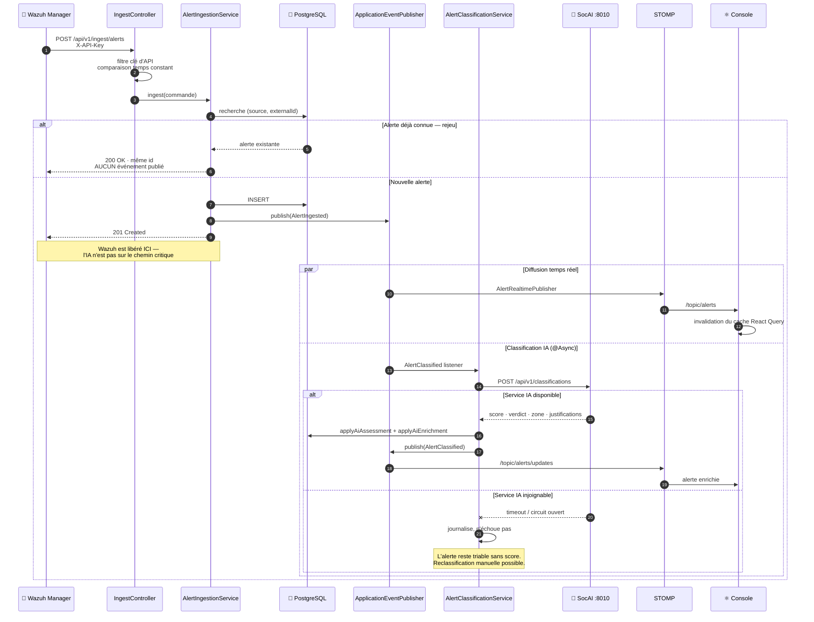
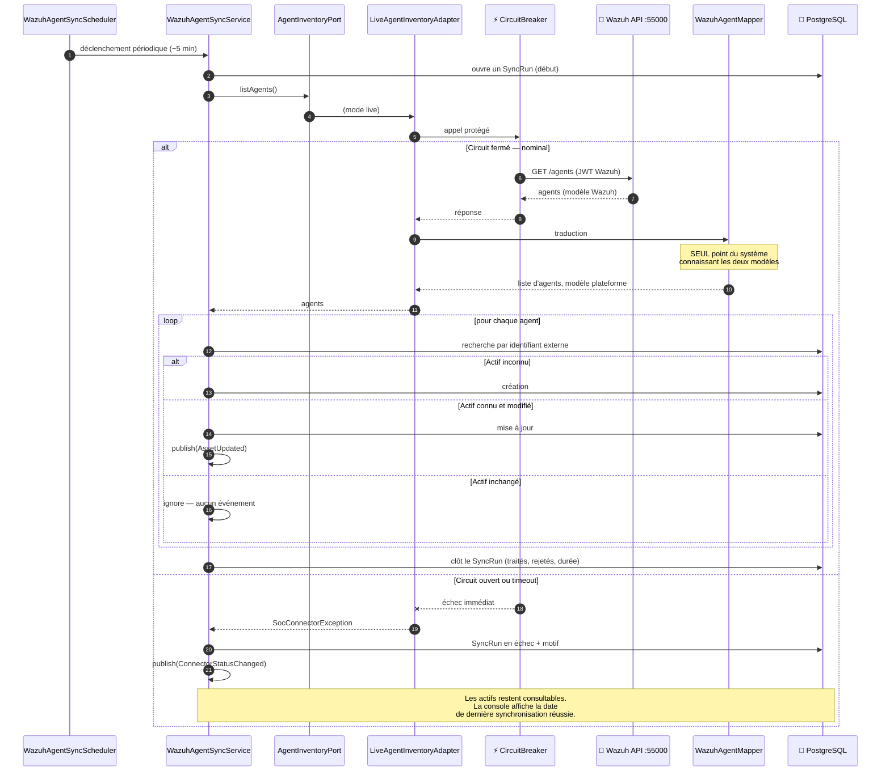
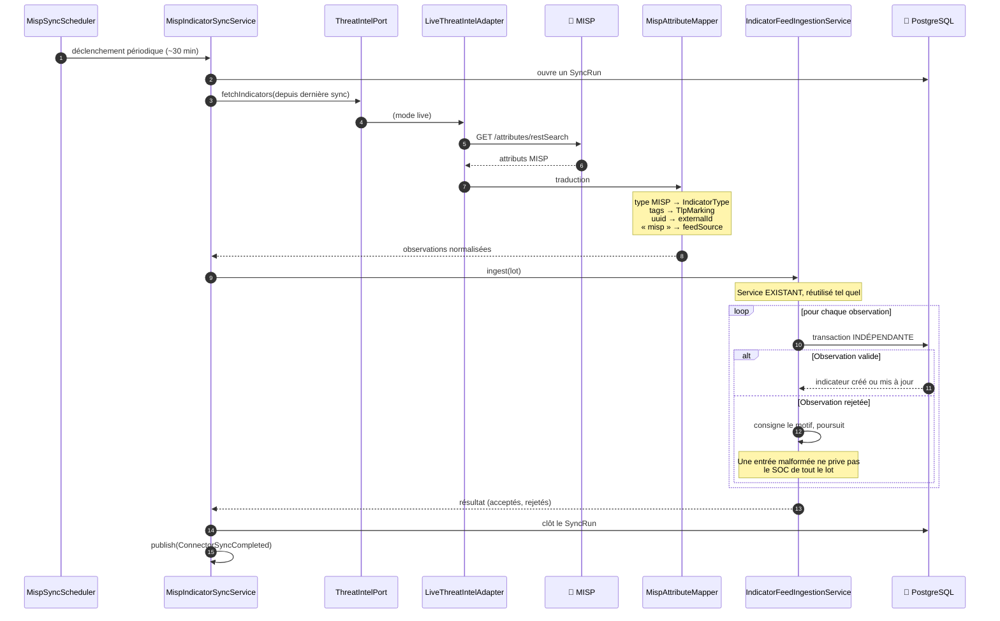
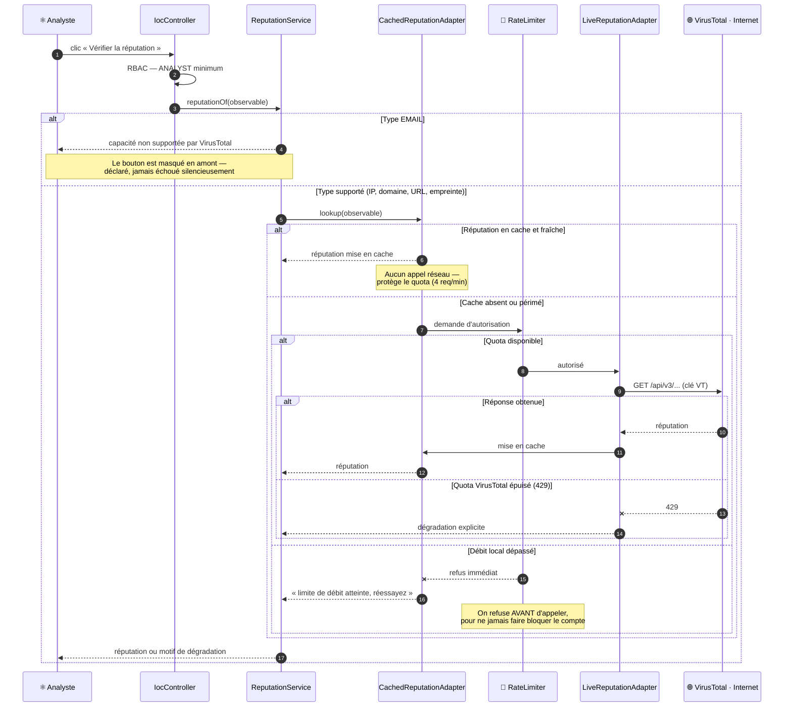
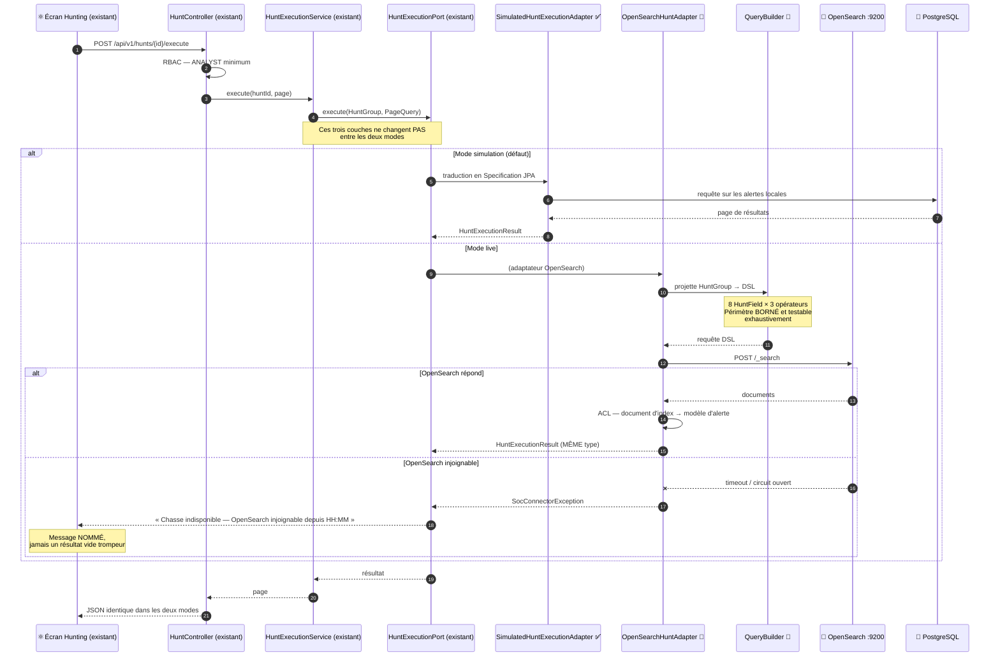
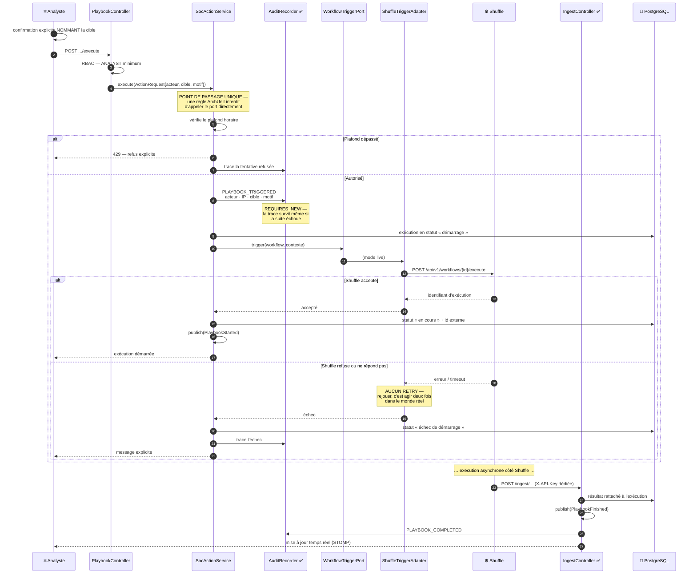

# Diagrammes de séquence — SmartSOC Enterprise

- **Date** : 2026-08-05
- **Convention** : ✅ flux implémenté et vérifié en réel · 🔨 flux prévu par la
  [baseline d'intégration](soc-integration-plan.md)

---

## 1 · Ingestion d'une alerte Wazuh ✅

Le seul flux d'intégration déjà opérationnel. Il illustre trois règles
structurantes : idempotence, IA hors chemin critique, temps réel par événement.

**Points vérifiés en conditions réelles :** le rejeu ne crée pas de doublon et ne
republie rien ; le webhook répond avant la classification ; un service IA éteint
laisse l'alerte pleinement exploitable.

---

## 2 · Synchronisation des agents Wazuh 🔨

Premier flux sortant. Il fonde le socle réutilisé par tous les connecteurs.

**Règle clé :** la console ne lit jamais Wazuh. Elle lit PostgreSQL, alimenté par
cette synchronisation — un outil éteint dégrade la fraîcheur, jamais la
disponibilité.

---

## 3 · Synchronisation MISP 🔨

Même socle, avec la tolérance par élément déjà en place côté CTI.

**Aucune modification du domaine Intelligence** : `feedSource` et `externalId`
existent déjà sur `Indicator`, et `IndicatorFeedIngestionService` est réutilisé
sans changement. Le connecteur ne fait qu'alimenter un modèle inchangé.

---

## 4 · Enrichissement VirusTotal 🔨

Le seul flux qui sort du réseau privé, et le seul soumis à un quota strict.

---

## 5 · Threat Hunting sur OpenSearch 🔨

La meilleure démonstration de l'architecture hexagonale : **seul l'adaptateur
change**, le port, le service, l'API et l'écran restent intacts.

---

## 6 · Déclenchement d'un playbook Shuffle 🔨 ⚠

Le flux le plus encadré du système : effet réel sur des machines de production.

**Six garde-fous visibles dans ce diagramme :** confirmation nommant la cible ·
RBAC · point de passage unique vérifié par ArchUnit · plafond horaire · audit
avant l'action (et non après) · aucun retry.
