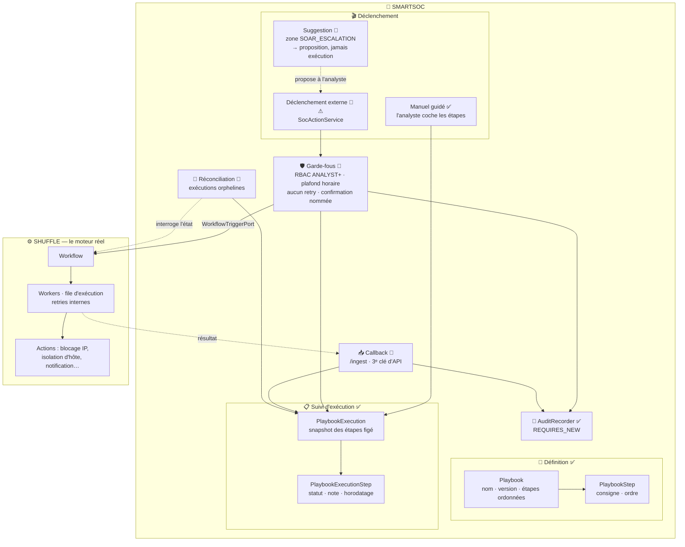
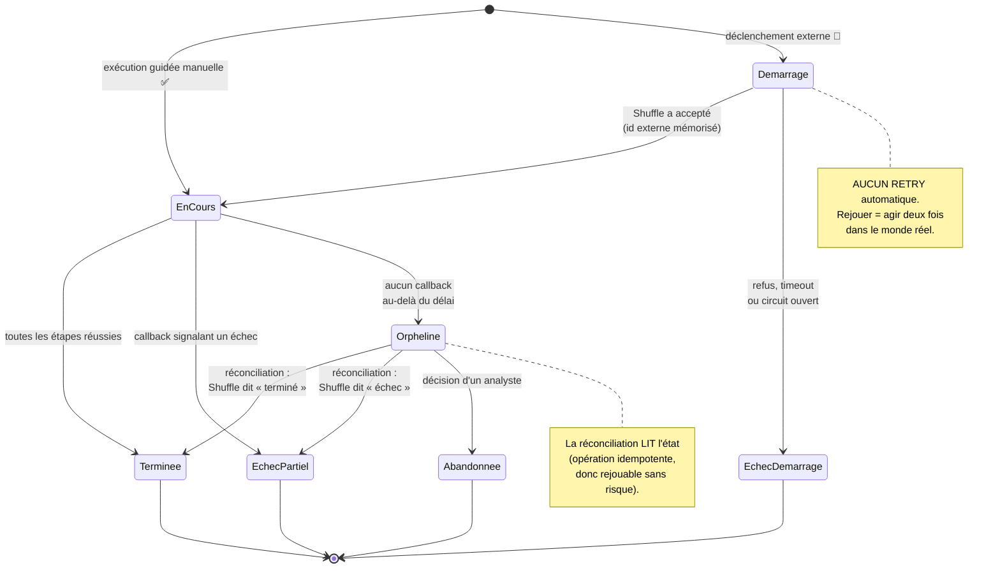
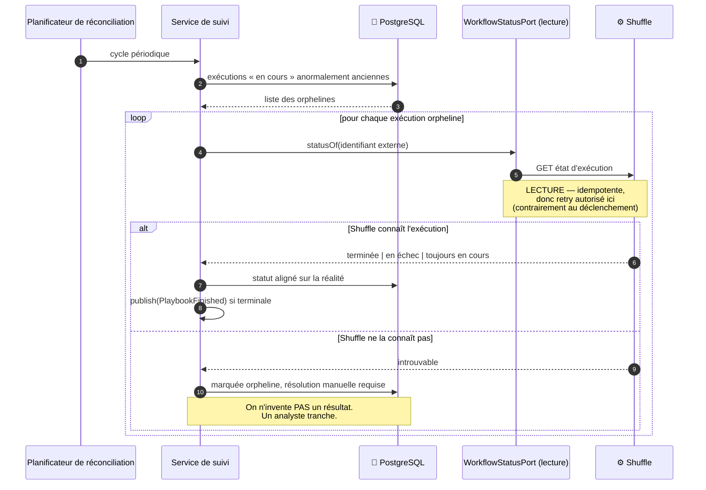

# Architecture SOAR — SmartSOC Enterprise

- **Date** : 2026-08-05
- **Cadre** : [ADR-012](adr/ADR-012-soar-playbooks.md) (playbooks) et
  [baseline d'intégration](soc-integration-plan.md) phase 5
- **Convention** : ✅ implémenté · 🔨 prévu phase 5 · ⚠ effet réel sur des
  machines de production

---

## 1. La décision structurante : qui exécute quoi

C'est le point le plus important de ce chapitre, et il évite une erreur
coûteuse.

**SmartSOC ne construit pas de moteur d'automatisation.** Shuffle en est un,
éprouvé, avec ses propres workers, sa file d'exécution et ses connecteurs. En
reconstruire un dans la plateforme reviendrait à maintenir deux moteurs
concurrents pour un seul besoin.

| Responsabilité | Titulaire | Pourquoi |
| --- | --- | --- |
| Définir un playbook (étapes, ordre, consignes) | **SmartSOC** ✅ | C'est de la doctrine SOC, propriété de l'équipe |
| Exécution **guidée manuelle** (l'analyste coche) | **SmartSOC** ✅ | Cas d'usage majoritaire : tous les playbooks ne s'automatisent pas |
| Décider de déclencher | **SmartSOC** 🔨 ⚠ | RBAC, audit, plafond — la décision est un acte tracé |
| **Exécuter** l'automatisation (workers, files, retries internes) | **Shuffle** | C'est son métier ; il le fait mieux |
| Suivre, tracer, restituer | **SmartSOC** 🔨 | Seule interface utilisateur (objectif Gateway) |

**Conséquence directe : il n'y a pas de « workers » dans SmartSOC.** Les workers
sont ceux de Shuffle. La plateforme possède un *suivi d'exécution*, pas un
ordonnanceur de tâches. Ce document nomme donc explicitement ce qui, dans le
vocabulaire SOAR classique, est délégué.

---

## 2. Vue d'ensemble du moteur

---

## 3. Cycle de vie d'une exécution

**Principe d'immutabilité déjà en vigueur :** démarrer une exécution fige une
copie des étapes du playbook. Modifier le playbook ensuite ne change **jamais**
une exécution déjà démarrée — une trace de réponse à incident doit refléter ce
qui a réellement été fait.

---

## 4. Gestion des erreurs

| Situation | Comportement | Justification |
| --- | --- | --- |
| **Shuffle refuse ou ne répond pas** | Statut `EchecDemarrage`, motif consigné, audit écrit, message explicite à l'analyste. **Aucun retry.** | Un déclenchement n'est pas idempotent : réessayer pourrait isoler deux fois une machine |
| **Circuit ouvert** | Échec immédiat sans appel réseau | Protège la plateforme et évite d'aggraver un incident côté Shuffle |
| **Plafond horaire dépassé** | Refus explicite (429), **tentative tout de même auditée** | Une tentative refusée est une information de sécurité |
| **Callback jamais reçu** | Passage en `Orpheline` après délai, puis réconciliation | Un réseau peut perdre un callback ; l'exécution ne doit pas rester indéfiniment « en cours » |
| **Callback en double** | Ignoré grâce à l'identifiant d'exécution externe | Même doctrine d'idempotence que l'ingestion d'alertes |
| **Callback signalant un échec** | Statut `EchecPartiel`, résultat affiché tel quel | Un échec est un résultat : il se publie et se trace comme un succès |
| **Callback non authentifié** | Rejeté par le filtre de clé d'API | Une exécution SOAR ne se déclare pas terminée sans preuve d'identité |
| **RBAC insuffisant** | 403, tentative auditée | Le refus est aussi intéressant à tracer que l'autorisation |

---

## 5. Reprise et réconciliation 🔨

Le seul mécanisme automatique autorisé à s'exécuter seul, précisément parce
qu'il est **en lecture**.

**Ce que la reprise ne fait jamais :** relancer automatiquement un playbook
échoué. Un nouveau déclenchement est une **nouvelle décision humaine**, avec sa
propre entrée d'audit.

---

## 6. Traçabilité

Trois traces distinctes et complémentaires accompagnent chaque exécution :

| Trace | Contenu | Destinataire |
| --- | --- | --- |
| **Journal d'audit** ✅ | Acteur, IP, cible, motif, horodatage — écrit **avant** l'action | Sécurité, conformité |
| **Suivi d'exécution** ✅ | Étapes, statuts, notes de l'analyste | Opérationnel |
| **Chronologie d'incident** ✅ | « Playbook X déclenché par Y » | Reconstitution de l'enquête |

Deux propriétés méritent d'être soulignées :

- l'audit est écrit **avant** le déclenchement, jamais après — si la plateforme
  s'arrêtait entre les deux, la tentative resterait tracée ;
- `AuditRecorder` utilise `REQUIRES_NEW`, donc la trace survit à l'échec de la
  transaction appelante.

---

## 7. Le garde-fou structurel

Toutes les règles ci-dessus reposent sur un point de passage unique. Pour qu'il
soit impossible à contourner par inadvertance, il est **vérifié par machine** :

> **Règle ArchUnit (phase 5)** — aucune classe extérieure à
> `application.connectors.actions` ne peut dépendre d'un port du package
> `actions.ports`.

Conséquence : tout déclenchement passe nécessairement par `SocActionService`,
donc par le RBAC, le plafond, l'audit et l'interdiction de retry. Un développeur
qui tenterait d'appeler `WorkflowTriggerPort` directement casserait la CI.

C'est la même démarche que l'ADR-002, dont les règles de couches sont exécutées à
chaque build plutôt que promises dans une documentation.

---

## 8. Ce qui n'est volontairement pas construit

| Écarté | Raison |
| --- | --- |
| Moteur d'exécution propre à SmartSOC | Shuffle le fait mieux ; deux moteurs seraient deux fois la maintenance |
| Workers / file de tâches | Appartiennent à Shuffle (§1) |
| Déclenchement **automatique** sur alerte | Décision d'exploitation, pas de développement. La V1 garde l'analyste dans la boucle. La suggestion automatique (zone `SOAR_ESCALATION`) **propose**, elle n'exécute pas. |
| Retry automatique d'une action | Non idempotent — agirait deux fois dans le monde réel |
| Édition de workflows Shuffle depuis SmartSOC | Hors périmètre : SmartSOC déclenche et suit, il ne conçoit pas les workflows |
