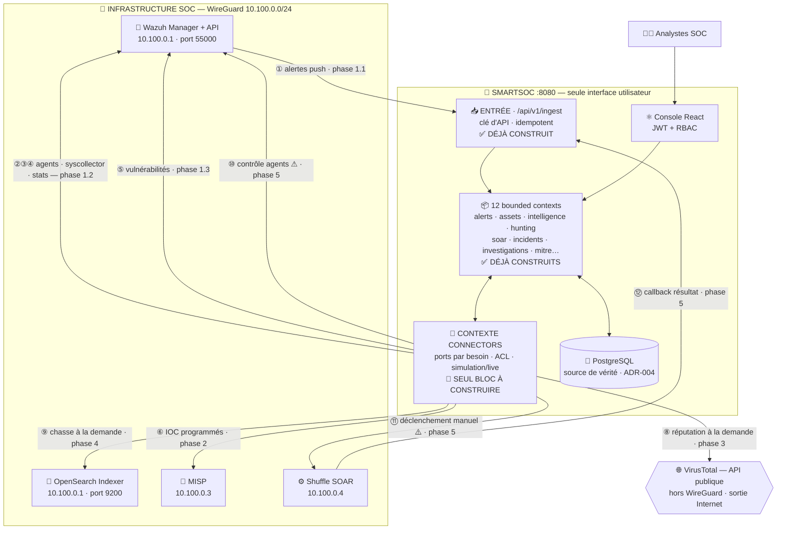

# Architecture de référence — Intégration SmartSOC ↔ Infrastructure SOC

- **Statut** : **Architecture Baseline v1.1 — figée**
- **Date** : 2026-08-05
- **Décision associée** : [ADR-014](adr/ADR-014-soc-integration-architecture.md)
- **Amendement v1.1** : 8 propositions d'évolutivité évaluées, **5 retenues,
  3 écartées avec justification technique** — voir l'amendement de l'ADR-014.
  Aucun choix structurant de la v1.0 n'est remis en cause.
- **Fondations conservées** : ADR-002 (Clean Architecture + ArchUnit), ADR-004
  (PostgreSQL source de vérité), ADR-005 (plateforme autonome + contrats),
  ADR-008 (ports/adaptateurs `simulation`/`live`)

> **Règle de gouvernance.** Les choix structurants de ce document ne sont plus
> modifiés. Toute décision découverte pendant l'implémentation fait l'objet d'un
> **ADR distinct**, jamais d'une réécriture de cette baseline.
>
> Ce document ne traite que d'**architecture**. La planification (charge,
> découpage en PR, dépendances de calendrier, suivi) vit dans
> [`PROJECT-PLANNING.md`](PROJECT-PLANNING.md), document **vivant**. Les vues
> détaillées (C4, séquences, événements, IA, SOAR, connecteurs) sont listées
> dans l'[index de la documentation](README.md).

---

## 1. Audit de la plateforme existante

Audit réalisé sur le code, pas sur la documentation. Il fixe le point de départ
réel et corrige plusieurs hypothèses de la version précédente de ce plan.

### 1.1 Inventaire

| Élément | Mesure réelle |
| --- | --- |
| Bounded contexts (domaine) | 12 : `alerts`, `assets`, `audit`, `common`, `hunting`, `identity`, `incidents`, `intelligence`, `investigations`, `mitre`, `reporting`, `soar` |
| Groupes d'endpoints REST | 16 (`/alerts`, `/assets`, `/assistant`, `/audit-logs`, `/auth`, `/hunts`, `/incidents`, `/ingest`, `/investigations`, `/iocs`, `/mitre`, `/playbooks`, `/reports`, `/settings`, `/settings/backup`, `/users`) |
| Migrations Flyway | 15 (V1 → V15), 21 tables |
| Modules frontend | 14 |
| Fichiers de test backend | 86, dont **35 tests d'intégration** (Testcontainers / `@SpringBootTest`) |
| Fichiers de test frontend | 18 |
| Filtres de clé d'API | 2 : `IngestApiKeyFilter`, `AiToolsApiKeyFilter` |
| Ports avec double adaptateur | 4 (classifieur IA, assistant IA, notifications, chasse) |

### 1.2 Ce qui est déjà prêt à recevoir le SOC

| Capacité | État vérifié |
| --- | --- |
| `POST /api/v1/ingest/alerts` | **Opérationnel** — `X-API-Key`, rôle `INGEST`, idempotent, contrat publié avec guide de mapping Wazuh |
| `POST /api/v1/ingest/iocs` | **Opérationnel également** — le chemin d'entrée CTI existe déjà, contrat publié |
| Chaîne de sécurité | `/api/v1/ingest/**` → `hasRole("INGEST")`, deux filtres de clé déjà enregistrés avant l'authentification par mot de passe |
| Temps réel | STOMP `/topic/alerts` + `/topic/alerts/updates` |
| Événements applicatifs | `AlertIngestedEvent` publié à l'ingestion, deux abonnés (classification IA, diffusion temps réel) |
| Traitement asynchrone | `AsyncConfig` + `@Async` en place (classification IA hors chemin critique) |
| Résilience | Resilience4j configuré par service, testé contre WireMock |
| Audit | `AuditRecorder` en `REQUIRES_NEW`, acteur + IP |
| Règles d'architecture | ArchUnit actif : domaine sans framework, `Infrastructure` et `Api` inaccessibles depuis les autres couches |

### 1.3 Trois corrections apportées par l'audit

**Correction 1 — `Indicator` porte déjà sa provenance.** La version précédente
annonçait qu'il faudrait ajouter un champ de provenance pour MISP. **C'est
faux** : l'entité possède déjà `feedSource` **et** `externalId`. La
synchronisation MISP ne demande donc **aucune modification du domaine
Intelligence**. L'intégration CTI est encore plus additive qu'annoncé.

**Correction 2 — Le langage de chasse est fermé, et c'est une bonne nouvelle.**
`HuntField` est un enum de **8 champs** (`SEVERITY`, `STATUS`, `SOURCE`,
`HOSTNAME`, `RULE_ID`, `DETECTED_AT`, `MITRE_TECHNIQUE`, `RAW_PAYLOAD_TEXT`) avec
3 opérateurs. L'adaptateur OpenSearch n'a donc pas à traduire un langage
arbitraire : il doit projeter **8 champs connus** sur les champs d'index. Le
problème est borné et testable exhaustivement.

*Contrepartie honnête :* la chasse restera de forme « alerte ». Chasser sur des
logs bruts quelconques demanderait d'étendre `HuntField` — décision métier
distincte, hors périmètre de l'intégration.

**Correction 3 — Aucune infrastructure de planification n'existe.** Ni
`@EnableScheduling`, ni `@Scheduled` nulle part dans le code. Or toutes les
synchronisations périodiques (agents Wazuh, IOC MISP) en dépendent. **Le socle de
planification fait donc partie du socle Connectors**, il n'est pas acquis.

### 1.4 Ce qui manque réellement

| Manque | Détail |
| --- | --- |
| **Contexte `connectors`** | Déclaré dans l'ADR-002 parmi les 8 bounded contexts, **jamais construit** |
| Clients sortants | Aucun appel plateforme → Wazuh / OpenSearch / MISP / VT / Shuffle |
| Planification | Aucune (correction 3) |
| Champs d'`Asset` | Ni OS, ni dernier contact, ni identifiant externe — indispensables pour réconcilier un agent Wazuh |
| Domaine vulnérabilités | Le mot n'apparaît **nulle part** dans le code |
| Chasse `live` | Le code dit lui-même : mode OpenSearch « différé jusqu'à disposer d'un schéma d'index réel plutôt que deviné » |
| SOAR réel | `PlaybookExecutionService` est une **checklist guidée manuelle**, pas un moteur d'exécution |
| Route réseau | Backend en réseau Docker **bridge** ; accès à `10.100.0.0/24` **non vérifié** |

---

## 2. Trois contraintes techniques structurantes

### Contrainte 1 — L'API Wazuh ne sert pas les alertes

L'API Wazuh (port 55000) est une **API de gestion** : agents, groupes, règles,
inventaire système (syscollector), FIM (syscheck), statistiques, commandes de
contrôle. Elle n'expose **aucun endpoint de consultation d'alertes** — celles-ci
partent du Manager vers l'Indexer.

Deux chemins seulement :

| Chemin | Disponibilité | Coût |
| --- | --- | --- |
| **Wazuh pousse** vers `/api/v1/ingest/alerts` | **Immédiate** (endpoint testé, contrat publié) | **Zéro ligne de code plateforme** |
| Requête sur l'Indexer OpenSearch | Après mapping réel | Connecteur complet |

**La séparation fonctionnelle que tu demandes est conservée** (étape « alertes »
puis étape « API Wazuh »), avec cette nuance technique inscrite noir sur blanc :
l'étape « alertes » passe par le webhook, pas par l'API.

### Contrainte 2 — Les vulnérabilités sont un module métier

Le concept n'existe nulle part. L'intégrer demande : entité de domaine,
migration, dépôt, service, endpoints, écran, tests — l'équivalent de Threat
Hunting ou SOAR.

**Ta décision est appliquée** : ce module reste **dans le périmètre fonctionnel
Wazuh** (étape 1.3), afin que tout ce qui provient de Wazuh forme un ensemble
cohérent. Il est simplement identifié comme l'étape la plus lourde, pour que sa
charge ne soit pas sous-estimée au moment de la planifier.

*À trancher en phase 0 :* selon la version de Wazuh déployée, les vulnérabilités
proviennent de l'API ou directement de l'Indexer. Si c'est l'Indexer, l'étape 1.3
s'exécutera après la phase OpenSearch — la roadmap le prévoit explicitement.

### Contrainte 3 — VirusTotal n'est pas sur WireGuard

C'est un service **public sur Internet** : second chemin réseau, à valider
séparément en phase 0, avec ses propres implications (sortie Internet autorisée,
proxy éventuel, quota, secret exposé hors du périmètre privé).

**Option C retenue** (validée) : MISP fournit le fond CTI, VirusTotal sert les
consultations ponctuelles de l'analyste.

*Détail utile :* `IndicatorType` compte 8 types (IPV4, IPV6, DOMAIN, URL, MD5,
SHA1, SHA256, EMAIL). VirusTotal en couvre 7 — **il n'analyse pas les adresses
e-mail**. Le bouton d'enrichissement sera donc masqué pour ce type, plutôt que
d'afficher une erreur.

---

## 3. Stratégie générale

### 3.1 Principe directeur — deux directions, deux régimes de risque

| | **Entrante (push)** — outil → SmartSOC | **Sortante (pull/act)** — SmartSOC → outil |
| --- | --- | --- |
| Exemples | Alertes Wazuh, IOC, callback Shuffle | API Wazuh, OpenSearch, MISP, VT, déclenchement Shuffle |
| Code plateforme | **Déjà écrit** | **Entièrement à écrire** |
| Si l'autre est éteint | L'alerte n'arrive pas ; la plateforme fonctionne | La plateforme doit dégrader, jamais planter |
| Risque | **Faible** | **Élevé** — c'est là que porte l'effort |

### 3.2 Méthodologie — tranches verticales vérifiées en réel

Chaque étape produit une **tranche verticale démontrable**, de l'outil SOC
jusqu'à un écran, jamais une couche horizontale. On branche **un outil,
complètement, jusqu'à l'écran**, on le vérifie contre l'infrastructure réelle,
puis on passe au suivant.

Raisons propres à ce projet :

1. **Le risque est dans l'inconnu, pas dans le volume.** Le code de connecteur
   est répétitif. Ce qui fait échouer ces chantiers : une route qui ne passe pas,
   un certificat auto-signé, un champ absent du modèle réel, un quota. Une
   tranche verticale rencontre ces obstacles dès la première étape.
2. **Chaque étape est soutenable seule** — il existe à tout moment une version
   démontrable.
3. **La plateforme reste autonome** (ADR-005) : mode `simulation` partout.
4. **Compatible avec le workflow en vigueur** : validation avant implémentation,
   2 PR par module (backend puis frontend).

### 3.3 Risques et mécanismes de réduction

| # | Risque | Pourquoi c'est réel ici | Réduction |
| --- | --- | --- | --- |
| R1 | Le conteneur ne joint pas `10.100.0.0/24` | Backend sur bridge Docker ; WireGuard est une interface de l'**hôte**. Routage ni automatique ni garanti. | **Phase 0 dédiée.** Par ordre de préférence : route + `ip_forward` sur l'hôte ; IP hôte + `extra_hosts` ; `network_mode: host` en dernier recours (casse l'isolation). Tranché sur mesure. |
| R2 | Certificats auto-signés (Wazuh, OpenSearch, MISP) | Installation par défaut en TLS auto-signé ; un client Java refuse. | Truststore dédié monté dans l'image. **Jamais** de `trustAllCerts` — ce serait annuler le chiffrement qu'on vient d'établir. |
| R3 | Le modèle réel diffère du modèle supposé | Un agent Wazuh, un attribut MISP, un document d'index n'ont pas la forme qu'on imagine. | **ACL obligatoire** + **capture d'échantillons réels en phase 0**, versionnés comme fixtures de test. |
| R4 | Quota VirusTotal (4 req/min, 500/jour en offre gratuite) | Un enrichissement automatique sur flux épuise le quota en minutes. | Cache + limiteur de débit + **à la demande de l'analyste uniquement**. |
| R5 | Action réelle non maîtrisée | `active-response` Wazuh et Shuffle agissent sur des machines de production. | Classe à part (phase 5) : jamais automatique, ANALYST+, audit nominatif, confirmation UI, **aucun retry**. |
| R6 | Volume d'alertes | Un Wazuh réel produit des milliers d'événements/jour ; la console n'est pas un SIEM. | Filtrage **à la source** (règles de niveau ≥ N). SmartSOC reçoit des **alertes**, le brut reste dans OpenSearch. |
| R7 | Fuite d'identifiants | 4 nouveaux jeux de secrets entrent dans le projet. | Variables d'environnement uniquement ; Gitleaks actif sur tout l'historique ; l'API expose « configuré / non configuré », **jamais** la valeur. |
| R8 | Régression sur l'existant | 86 fichiers de test backend, 18 frontend, une plateforme qui fonctionne. | Chaque connecteur est **additif**, derrière un port, en `simulation` par défaut. **Tous les tests existants doivent rester verts à chaque PR** — définition opérationnelle de « ne pas refactoriser inutilement ». |

---

## 4. Roadmap de référence

Cloudflare Tunnel est **hors périmètre fonctionnel** : opération d'exposition,
réalisée après validation complète.

```
Phase 0 ── Validation réseau + inventaire des capacités        ← BLOQUE TOUT
   ▼
Phase 1 ── INTÉGRATION WAZUH  (le domaine fonctionnel le plus large)
   │   1.1 · Alertes — push webhook                 zéro code plateforme
   │   1.2 · API Wazuh en lecture                   + SOCLE CONNECTORS
   │         agents, syscollector, statistiques
   │   1.3 · Vulnérabilités                         nouveau module métier
   ▼
Phase 2 ── MISP — source CTI principale
   ▼
Phase 3 ── VirusTotal — enrichissement ponctuel (option C)
   ▼
Phase 4 ── OpenSearch — chasse réelle
   ▼
Phase 5 ── ACTIONS RÉELLES
   │         contrôle des agents Wazuh + Shuffle (déclenchement manuel)
   ▼
Phase 6 ── VALIDATION COMPLÈTE DE LA PLATEFORME
   ▼
   ─── Intégration terminée et validée ──► exposition Cloudflare (hors périmètre)
```

Les phases 2 et 3 sont indépendantes l'une de l'autre et peuvent être menées en
parallèle si nécessaire.

---

### Phase 0 — Validation réseau et inventaire des capacités
*~1 jour, aucun code livré*

**A. Connectivité.** Depuis l'intérieur du conteneur backend :

| Cible | Adresse | Chemin |
| --- | --- | --- |
| Wazuh API | `10.100.0.1:55000` | WireGuard |
| OpenSearch | `10.100.0.1:9200` | WireGuard |
| MISP | `10.100.0.3` | WireGuard |
| Shuffle | `10.100.0.4` | WireGuard |
| **VirusTotal** | `virustotal.com` | **Internet (contrainte 3)** |

Puis la même chose **en TLS avec vérification de certificat** — c'est la vraie
question (R2) : un `curl -k` qui passe ne prouve rien d'exploitable.

**B. Inventaire des capacités et capture d'échantillons réels.** Interroger
chaque API et **enregistrer de vraies réponses** : un agent, un résultat
syscollector, un attribut MISP, un document d'index, une réponse VT. Ces
échantillons deviennent les **fixtures de test de l'ACL** — le meilleur
investissement du plan (R3). C'est aussi ici qu'on tranche l'origine des
vulnérabilités selon la version de Wazuh (contrainte 2).

**Fini quand :** chaque cible répond en TLS vérifié depuis le conteneur, les
échantillons sont versionnés, l'ADR-014 consigne la topologie retenue.

---

### Phase 1 — Intégration Wazuh

Tout ce qui provient de Wazuh forme un seul domaine fonctionnel, en trois étapes
ordonnées par risque croissant.

#### Étape 1.1 — Alertes (push webhook)

Wazuh Manager pousse ses alertes vers `POST /api/v1/ingest/alerts` (script
d'intégration + `X-API-Key`), avec filtrage par niveau de règle **à la source**.

**Pourquoi en premier :** le code existe et il est testé. Cette étape transforme
SmartSOC d'une démo alimentée par script en **console alimentée par un vrai
SIEM**, et valide d'un coup : chemin réseau entrant, authentification par clé,
mapping des sévérités, déduplication, temps réel STOMP, classification IA sur
alertes réelles. Aucun autre ordre ne valide autant pour aussi peu.

**Travail :** configuration Wazuh (côté SOC) + vérification et affinage du guide
de mapping publié (côté plateforme). **Zéro code applicatif.**

**Fini quand :** une attaque lancée depuis Kali produit une alerte visible dans
la console **sans rechargement**, classifiée par l'IA, et son rejeu ne crée pas
de doublon.

#### Étape 1.2 — API Wazuh en lecture *(+ construction du socle Connectors)*

Première intégration sortante. Elle fonde tout le reste.

**Socle à construire** (réutilisé par tous les connecteurs suivants) :
bounded context `connectors`, `SocConnector`/`SyncRun`, mode
`simulation`/`live`, gestion des secrets, sonde de santé, résilience,
**infrastructure de planification** (`@EnableScheduling` — inexistante,
correction 3), classe de base de synchronisation, tests WireMock.

**Capacités livrées :**

| Source Wazuh | Destination plateforme |
| --- | --- |
| Agents (nom, IP, OS, dernier contact, statut) | Module **Actifs** existant |
| Syscollector (matériel, OS, paquets, ports) | Enrichit la fiche d'actif |
| Statistiques Manager/agents | Section **Connecteurs** des Paramètres (aujourd'hui « à venir ») |

**Pourquoi ce connecteur ouvre la direction sortante :** l'API Wazuh est la mieux
documentée du lot ; le modèle « agent » se projette sur l'entité `Asset`
**existante** ; l'opération est en **lecture seule et idempotente** — le pire
échec est « les actifs ne se mettent pas à jour », jamais une corruption. Le
socle est ainsi validé sur un cas sûr avant les cas difficiles.

**Impact sur l'existant :** colonnes nullables ajoutées à `assets` (OS, dernier
contact, identifiant externe, source) par migration additive. Aucun comportement
modifié, aucun test existant impacté.

**Fini quand :** les agents réels apparaissent comme actifs dans la console, la
synchronisation est tracée, et couper Wazuh laisse les actifs consultables avec
leur date de dernière synchronisation affichée honnêtement.

#### Étape 1.3 — Vulnérabilités *(nouveau module métier, domaine Wazuh)*

Module complet : domaine, migration, dépôt, service, endpoints, écran, tests —
alimenté par Wazuh, rattaché aux actifs existants.

**Étape la plus lourde de la phase 1** (contrainte 2), à planifier comme telle.

**Tranché en réel le 2026-08-09** (pas en phase 0 comme initialement prévu —
vérifié directement contre `vm-siem` une fois la question posée) :
`GET /vulnerability/{agent_id}` de l'API Wazuh renvoie `404 Not Found` sur
cette instance (Wazuh v4.12.0 — le détecteur de vulnérabilités classique de
l'API a été retiré des versions récentes), confirmé sur un token valide et
en contrôle croisé avec `/agents` qui répond normalement. L'Indexer, lui,
porte bien l'index `wazuh-states-vulnerabilities-vm-siem` peuplé de 1994
documents réels (`agent`, `host.os`, `package`, `vulnerability.{id, severity,
score, description, detected_at, scanner…}` — échantillon capturé dans
`docs/integration/fixtures/wazuh/vulnerabilities-indexer-sample.json`).
**Source confirmée : l'Indexer.**

Construite néanmoins **avant** le mapping Hunting de la phase 4 : la
dépendance dure documentée pour la phase 4 (« le mapping exige un schéma réel,
produit par plusieurs jours d'indexation ») concerne l'index **des alertes**
(`wazuh-alerts-*`), pas celui des vulnérabilités — déjà mûr et au schéma
stable (`wazuh.schema.version: "1.0.0"`), vérifié en réel ci-dessus. Un
client OpenSearch partagé (config/Basic Auth/circuit breaker, même patron que
le client Wazuh) est donc construit maintenant pour `VulnerabilityFeedPort` ;
le mapping Hunting (8 champs × 3 opérateurs sur l'index d'alertes) reste pour
la phase 4, quand cet index aura plus de recul.

---

### Phase 2 — MISP, source CTI principale

Synchronisation périodique des attributs MISP vers le modèle `Indicator`
**existant**. MISP **alimente** la logique IOC de la plateforme, il ne la
remplace pas : `AlertEnrichmentService` continue de corréler les alertes aux
indicateurs en base, avec désormais un fond CTI réel.

**Aucune modification du domaine Intelligence** — `feedSource` et `externalId`
existent déjà (correction 1). Le connecteur écrit dans un modèle inchangé, et la
distinction entre indicateurs synchronisés et saisis manuellement est portée
nativement par `feedSource`.

**Choix technique : pull programmé** plutôt que push. Le contrat de push existe
(`/api/v1/ingest/iocs`), mais tirer donne la maîtrise du rythme et du volume, et
évite qu'un import massif côté MISP sature la plateforme.

---

### Phase 3 — VirusTotal, enrichissement ponctuel *(option C)*

Réputation d'un observable, **déclenchée par l'analyste** depuis le tiroir
d'alerte ou la fiche d'IOC. Jamais automatique sur le flux (R4).

Introduit deux mécanismes nouveaux : **cache persistant** (une réputation d'IP ne
change pas en cinq minutes) et **limiteur de débit** strict. Cas d'école du Cache
Pattern, traité au bon moment plutôt qu'en raccourci.

Bouton masqué pour le type `EMAIL`, non couvert par VirusTotal (contrainte 3).

---

### Phase 4 — OpenSearch, la chasse réelle

Second adaptateur du `HuntExecutionPort` **existant** : mode `live` interrogeant
les index Wazuh au lieu de la table `alerts` locale.

**Pourquoi ici — dépendance dure, pas préférence :** le mapping exige le schéma
d'index **réel**, qui n'existe qu'après plusieurs jours d'indexation par un vrai
Wazuh (étape 1.1). C'est exactement la raison inscrite dans le code aujourd'hui.
Plus tôt, ce serait deviner.

**Portée bornée et testable** (correction 2) : 8 champs, 3 opérateurs à projeter
sur les champs d'index. Pas un langage arbitraire.

**Le meilleur test de l'architecture :** le port, le service, l'API et l'écran
Hunting existent déjà. Cette phase n'ajoute **qu'un adaptateur**. Si l'hexagonal
tient ses promesses, rien d'autre ne bouge — et c'est démontrable.

---

### Phase 5 — Actions réelles : contrôle des agents + Shuffle

Regroupées : ce sont les deux seules capacités qui **agissent sur le monde réel**,
et elles partagent exactement les mêmes exigences.

- **Contrôle des agents Wazuh** : redémarrage, active-response
- **Shuffle** : déclenchement **manuel** d'un playbook par un analyste ; Shuffle
  rappelle la plateforme via le webhook pour rapporter son résultat (direction
  entrante — un troisième filtre de clé d'API, sur le patron des deux existants)

**Pourquoi en dernier :** accorder un pouvoir d'action exige que toute la chaîne
soit éprouvée — identité fiable, audit complet, RBAC strict, alertes qu'on sait
interpréter. Plus tôt, on donnerait un pouvoir d'action à un système dont on ne
maîtrise pas encore les entrées.

**Garde-fous non négociables :** ANALYST+ uniquement ; confirmation explicite
nommant la cible ; audit nominatif avec IP ; **aucun retry** (rejouer, c'est agir
deux fois) ; plafond d'exécutions par heure ; marquage d'origine pour prévenir
toute boucle d'amplification.

---

### Phase 6 — Validation complète de la plateforme

Phase à part entière, avec ses propres livrables — pas une relecture finale.

| Volet | Contenu | Méthode |
| --- | --- | --- |
| **Fonctionnel** | Les 14 modules et 16 groupes d'endpoints parcourus avec des données réelles | Campagne manuelle scénarisée, consignée module par module |
| **Intégration des connecteurs** | Chaque connecteur vérifié contre son outil **réel** (pas WireMock) | Vérification E2E en conditions réelles, comme pratiqué depuis le début du projet |
| **Résilience** | Outil éteint, timeout, **perte WireGuard**, certificat expiré, quota VT épuisé, Indexer saturé | Pannes **réellement provoquées** (arrêt de VM, coupure du tunnel), pas simulées |
| **Charge** | Volume d'alertes réel mesuré en phase 1, puis tir soutenu | Script de tir ; dimensionne le filtrage Wazuh |
| **Sécurité** | Chaîne DevSecOps existante (CodeQL, Trivy, Gitleaks, SonarCloud, dependency-review) + **pentest depuis la VM Kali du SOC** | La VM Kali sert déjà à simuler des attaques : elle peut légitimement viser SmartSOC lui-même |
| **Pré-production** | Revue des secrets, des sauvegardes, du journal d'audit, de la documentation | Liste de contrôle formelle avant exposition |

**Fini quand :** chaque volet est consigné avec ses preuves, et la décision
d'exposer la plateforme est prise sur des faits mesurés.

---

## 5. Architecture backend

### 5.1 Principe : `connectors` est un contexte, pas une couche

Erreur à éviter : créer un package `connectors` à côté de `domain`,
`application`, `infrastructure` — **ArchUnit le refuserait**, et ce serait
contraire à l'ADR-002. Les connecteurs sont des **adaptateurs sortants** : leur
place est dans `infrastructure`, leurs **ports** dans `application`. Le contexte
`connectors` désigne le domaine métier *de la supervision des connecteurs*
(état, santé, dernière synchronisation) — cela, oui, mérite un bounded context.

**Convention de placement des ports, déduite du code existant :**

| Type de port | Emplacement | Exemples existants |
| --- | --- | --- |
| Capacité **du domaine** | `domain` | `AlertRepository`, `HuntExecutionPort` |
| Intégration d'un **service externe** | `application` | `AlertClassifier`, `SocAssistant`, `ReportNotifier`, `DatabaseBackupPort` |

Les ports de connecteurs relèvent de la seconde catégorie : ils vont dans
`application`. Ce n'est pas une préférence, c'est la convention déjà en vigueur.

### 5.2 Arborescence

```
smartsoc-domain/                          ← Java pur, ZÉRO framework (ArchUnit)
└── connectors/
    ├── ConnectorType.java                WAZUH, OPENSEARCH, MISP, VIRUSTOTAL, SHUFFLE
    ├── ConnectorCapability.java          capacité supportée par un connecteur
    ├── ConnectorDescriptor.java          type + version DÉTECTÉE + capacités
    ├── SocConnector.java                 état, dernière sync, dernier échec
    ├── ConnectorStatus.java              CONNECTED · DEGRADED · DISCONNECTED
    │                                     NOT_CONFIGURED · DISABLED
    ├── SyncRun.java                      trace horodatée d'une synchronisation
    └── SocConnectorRepository.java

smartsoc-application/
└── connectors/
    ├── ports/                            ← CONTRATS SORTANTS · LECTURE SEULE
    │   ├── AgentInventoryPort.java       « donne-moi les agents »        → Wazuh
    │   ├── SystemInventoryPort.java      « décris cette machine »        → Wazuh syscollector
    │   ├── ManagerStatsPort.java         « comment va le SIEM ? »        → Wazuh
    │   ├── VulnerabilityFeedPort.java    « quelles vulnérabilités ? »    → Wazuh
    │   ├── ThreatIntelPort.java          « donne-moi les IOC »           → MISP
    │   ├── ObservableReputationPort.java « quelle réputation ? »         → VirusTotal
    │   ├── EventSearchPort.java          « cherche des événements »      → OpenSearch
    │   └── ConnectorCapabilityPort.java  « quelle version, quelles capacités ? »
    │
    ├── actions/                          ← ⚠ SOUS-CONTEXTE ISOLÉ · EFFET RÉEL
    │   ├── ports/
    │   │   ├── AgentControlPort.java     « redémarre / active-response » → Wazuh
    │   │   └── WorkflowTriggerPort.java  « exécute ce workflow »         → Shuffle
    │   ├── ActionRequest.java            acteur, cible, motif — jamais implicite
    │   ├── ActionOutcome.java
    │   └── SocActionService.java         POINT DE PASSAGE UNIQUE :
    │                                     RBAC + audit + plafond + aucun retry
    │
    ├── ConnectorStatusAggregator.java    agrège les états pour la console
    └── sync/
        ├── AbstractSyncTask.java         Template Method commun (trace, erreurs)
        ├── WazuhAgentSyncService.java
        ├── WazuhVulnerabilitySyncService.java
        └── MispIndicatorSyncService.java

smartsoc-infrastructure/
└── connectors/
    ├── common/     ConnectorProperties, ConnectorMode (SIMULATION · LIVE · DISABLED),
    │               AbstractConnectorHealthIndicator, exception commune
    ├── wazuh/      FeignClient, AuthInterceptor (JWT Wazuh), dto/, Mapper (ACL),
    │               Live*Adapter, Simulated*Adapter,
    │               WazuhHealthIndicator, WazuhCapabilityProbe,
    │               WazuhAgentSyncScheduler, WazuhVulnerabilitySyncScheduler,
    │               actions/ ← adaptateurs d'action (client et DTO mutualisés)
    ├── opensearch/ (même structure) + QueryBuilder (HuntGroup → DSL)
    ├── misp/       (même structure) + MispSyncScheduler
    ├── virustotal/ (même structure) + CachedReputationAdapter (décorateur)
    │                                 + @RateLimiter Resilience4j
    └── shuffle/    (même structure) + actions/

smartsoc-api/
└── connectors/     ConnectorController (ADMIN, lecture seule) + DTO
```

**Deux nuances de découpage, délibérées.**

*Les ports d'action sont isolés, les adaptateurs d'action ne le sont pas.* Dans
`application`, les actions vivent dans leur propre sous-contexte : c'est là que
s'attachent RBAC, audit, plafonnement et interdiction de retry, et la frontière
de package rend ces règles vérifiables. Dans `infrastructure`, les adaptateurs
d'action restent **dans le package de leur outil**, car ils partagent le client
Feign, l'intercepteur d'authentification et les DTO avec les adaptateurs de
lecture — les séparer dupliquerait cette plomberie sans rien protéger.

*Un planificateur par connecteur, un gabarit commun.* Chaque outil a sa propre
fréquence et son propre cycle ; ajouter un connecteur ne doit toucher aucun
fichier existant. Le comportement partagé (ouverture d'un `SyncRun`, capture des
erreurs, trace de fin) reste factorisé dans `AbstractSyncTask`.

**Règle ArchUnit à ajouter** — les actions à effet réel ne doivent jamais être
appelées en contournant les contrôles :

> Aucune classe hors de `application.connectors.actions` ne peut dépendre d'un
> port du package `actions.ports`. Tout passage par `SocActionService` est donc
> obligatoire, et l'audit devient structurellement impossible à oublier.

C'est la même démarche que l'ADR-002, dont les règles de couches sont vérifiées
par machine plutôt que promises par la documentation.

### 5.3 Rôle de chaque package

| Package | Rôle | Règle stricte |
| --- | --- | --- |
| `domain/connectors` | Vocabulaire métier de la supervision : type, état, dernière sync | **Zéro framework.** Ne sait pas que Wazuh existe. |
| `application/connectors/ports` | Interfaces définies selon **le besoin de la plateforme**, pas selon l'API des outils — **lecture seule** | Le nom décrit le **besoin**, jamais le fournisseur : `ThreatIntelPort`, pas `MispPort` |
| `application/connectors/actions` | ⚠ Sous-contexte des opérations à **effet réel** sur des machines de production | Passage obligatoire par `SocActionService` (RBAC + audit + plafond + aucun retry), **vérifié par ArchUnit** |
| `application/connectors/sync` | Orchestration : « pour chaque agent, créer ou mettre à jour l'actif » | Aucun HTTP, aucun JSON. Testable sans réseau. |
| `application/connectors/ConnectorStatusAggregator` | Compose l'état de tous les connecteurs pour la console | N'interroge pas les outils : lit les `HealthIndicator` et les `SyncRun` déjà produits |
| `infrastructure/.../*Scheduler` | Déclenchement périodique, **un par connecteur** | Ajouter un connecteur ne modifie aucun fichier existant |
| `infrastructure/.../*HealthIndicator` | Sonde de santé, **une par connecteur** | Spring Boot les agrège nativement dans `/actuator/health` |
| `infrastructure/.../*CapabilityProbe` | Détecte la **version** de l'outil et en déduit ses capacités | Rend explicite un comportement qui varie selon la version (voir §6.5) |
| `infrastructure/.../<outil>/dto` | Le modèle **de l'outil**, tel qu'il est vraiment | **Ne sort jamais de son package** |
| `infrastructure/.../<outil>/*Mapper` | **Anti-Corruption Layer** : seul endroit connaissant les deux vocabulaires | Point de contrôle unique. Wazuh change de format ⇒ un seul fichier bouge. |
| `infrastructure/.../Live*Adapter` | Implémente le port contre l'outil réel | Timeout + circuit breaker obligatoires |
| `infrastructure/.../Simulated*Adapter` | Même port, données plausibles **marquées comme simulées** | Garantit l'ADR-005 : la plateforme démarre sans SOC |
| `infrastructure/.../common` | Configuration, mode, santé, gabarit de synchronisation | Factorise ce qui serait dupliqué 5 fois |
| `api/connectors` | Expose l'**état** des connecteurs à la console | ADMIN, lecture seule |

### 5.4 Impact sur le code existant — inventaire complet

Consigne : ne rien refactoriser inutilement. Voici **exactement** ce qui bouge.
Tout le reste est création pure.

| Élément existant | Modification | Nature |
| --- | --- | --- |
| `Asset` + migration | Ajout : OS, dernier contact, identifiant externe, source | **Additif** — colonnes nullables, comportement inchangé |
| Écran Actifs | Affichage des nouveaux champs | **Additif** |
| `Indicator` | **AUCUNE** — `feedSource` et `externalId` existent déjà (correction 1) | **Zéro impact** |
| `AlertEnrichmentService` | **AUCUNE** — il corrèle déjà, avec un meilleur fond CTI | **Zéro impact** |
| Paramètres → « Connecteurs » | Section « à venir » → données réelles | **Remplacement d'un placeholder**, prévu par conception |
| `HuntExecutionPort` + service + API + écran | **AUCUNE** — un second adaptateur s'ajoute | **Zéro impact** |
| Ingestion d'alertes, STOMP, IA, audit | **AUCUNE** | **Zéro impact** |
| Configuration Spring | Ajout de `@EnableScheduling` | **Additif** |
| `PlaybookExecutionService` | Déclenchement externe optionnel (phase 5) | **Additif** |
| Les 12 bounded contexts | **Aucune refonte** | Ils gagnent des sources de données, pas des dépendances |

---

## 6. Découplage, patterns et communications

### 6.1 Les trois règles du découplage

1. **Un port par besoin, pas par outil.** Ajouter OpenCTI demain, c'est écrire un
   adaptateur, pas un port.
2. **Le modèle externe meurt à la frontière.** Un `WazuhAgentDto` n'existe que
   dans son package ; le domaine ne le voit jamais.
3. **Deux adaptateurs par port, toujours.** `simulation` par défaut — CI, tests
   et démonstration hors ligne fonctionnent sans un seul outil allumé.

### 6.2 Flux type

```
  Console React
      │  GET /api/v1/assets   (JWT + RBAC — inchangé)
      ▼
  AssetController ─► AssetService ─► AssetRepository ─► PostgreSQL
                                                            ▲ écrit
  ┌─────────────────────────────────────────────────────────┘
  │  AgentSyncService (application) — planifié
  │      ▼
  │  AgentInventoryPort  ◄── interface, ne connaît pas Wazuh
  │      ├── SimulatedAgentInventoryAdapter   (défaut)
  │      └── LiveAgentInventoryAdapter
  │              │ WazuhAgentMapper (ACL)
  │              ▼
  │          WazuhFeignClient ──HTTPS──► 10.100.0.1:55000 (WireGuard)
  └──────────────────────────────────────────────────────────
```

**Point capital :** la console lit **toujours** PostgreSQL, jamais l'outil en
direct (ADR-004). Un outil éteint ne rend jamais un écran vide — il rend des
données un peu plus anciennes, avec la date de dernière synchronisation affichée
honnêtement.

**Deux exceptions assumées**, justifiées par le besoin métier : l'enrichissement
VirusTotal et la chasse OpenSearch sont **à la demande** (l'analyste attend une
réponse fraîche). Appel synchrone, timeout court, dégradation explicite.

### 6.3 Design patterns retenus

| Pattern | Où | Problème réel résolu |
| --- | --- | --- |
| **Ports & Adapters** | Toute la direction sortante | La fondation : `simulation`/`live`, remplacement d'outil sans toucher au métier |
| **Anti-Corruption Layer** | `*Mapper` | Empêcher les modèles Wazuh/MISP de contaminer le domaine |
| **Adapter** | `Live*Adapter` | Traduire une API hétéroclite en l'interface définie par la plateforme |
| **Strategy** | Sélection `simulation`/`live` | Choix par configuration, sans `if` dispersés |
| **Factory** | Config Spring conditionnelle | Ne créer les beans Feign **qu'en** mode live — sinon la plateforme exigerait des URLs pour démarrer (patron `AiLiveConfig`) |
| **Facade** | `ConnectorHealthService` | Vue unifiée « état de tous les connecteurs » pour la console |
| **Gateway** | Le backend lui-même | L'objectif : point d'entrée unique, aucun outil exposé |
| **Circuit Breaker** | Chaque `Live*Adapter` | Un MISP en panne ne doit pas saturer les threads |
| **Retry** | Lectures idempotentes **seulement** | Une coupure WireGuard d'une seconde ne doit pas perdre une sync. **Interdit** sur les actions (phase 5) |
| **Rate Limiter** | VirusTotal | `@RateLimiter` Resilience4j posé sur l'adaptateur : le quota (4 req/min) est respecté quel que soit le client HTTP sous-jacent |
| **Cache** | VirusTotal (obligatoire), MISP (utile) | Le quota VT rend le cache non négociable |
| **Decorator** | `CachedReputationAdapter` | Ajouter le cache **sans** modifier l'adaptateur VT |
| **Observer / Event-Driven** | `AlertIngestedEvent` existant | Un nouvel abonné s'ajoute **sans modifier l'ingestion** — c'est ce qui rend l'intégration additive |
| **Template Method** | `AbstractSyncTask` | Toutes les syncs font : début → récupérer → mapper → réconcilier → tracer |
| **Builder** | `QueryBuilder` OpenSearch | Projeter les 8 `HuntField` sur le DSL, lisiblement |

**Écartés délibérément :** Saga (pas de transaction distribuée), CQRS
(complexité sans bénéfice à ce volume), Event Sourcing (l'audit couvre déjà la
traçabilité).

### 6.4 Quel mécanisme de communication, quand

| Mécanisme | Quand | Cas concrets |
| --- | --- | --- |
| **Webhook entrant** | L'outil décide quand parler. **À privilégier.** | Alertes Wazuh (1.1), callback Shuffle (phase 5) |
| **REST synchrone sortant** | L'utilisateur attend maintenant, la fraîcheur prime | VirusTotal à la demande, chasse OpenSearch |
| **REST sortant programmé** | Données de référence changeant lentement | Agents Wazuh (~5 min), IOC MISP (~30 min) |
| **Polling** | **Jamais** frontend → backend (règle d'architecture existante) | Aucun cas prévu |
| **Événement interne** | Réagir à un fait métier en découplant | `AlertIngestedEvent` → IA (existant) → enrichissement CTI |
| **WebSocket STOMP** | Pousser un changement vers la console | Nouvelle alerte, alerte enrichie, état d'un connecteur, avancement SOAR |

**Règle maintenue :** aucun outil SOC sur le **chemin critique** d'une requête
utilisateur, sauf les deux cas « à la demande » ci-dessus.

### 6.5 Activation, version et capacités des connecteurs

**Trois états par connecteur, généralisant le patron `simulation`/`live` de
l'ADR-008 :**

| Mode | Comportement | Usage |
| --- | --- | --- |
| `simulation` *(défaut)* | Adaptateur bouchonné, données marquées comme simulées | CI, démonstration hors ligne, développement |
| `live` | Appels réels à l'outil | Production |
| `disabled` | **Aucun bean créé**, statut `DISABLED` dans la console | Couper un connecteur sans toucher aux autres |

Un connecteur se coupe ou se rebranche par variable d'environnement et
redémarrage du conteneur — sans redéploiement d'image ni modification de code.

*Limite assumée et documentée :* ce n'est pas un basculement à chaud. Un vrai
commutateur dynamique (changement d'état sans redémarrage) demanderait un magasin
de flags, une interface d'administration et son propre audit — un module en soi,
volontairement hors périmètre de l'intégration. `simulation` joue déjà le rôle
d'un « arrêt sûr » : le connecteur cesse d'appeler l'outil tout en laissant la
plateforme pleinement utilisable, ce qu'un `disabled` brut ne permet pas.

**Version et capacités détectées, pas supposées.** Chaque connecteur `live`
interroge son outil au démarrage et à chaque reprise de circuit pour établir un
`ConnectorDescriptor` : version réelle et capacités qui en découlent.

Ce n'est pas de la généralisation spéculative — l'audit a mis au jour un cas
concret : **l'origine des données de vulnérabilité Wazuh dépend de la version**
(API sur les versions anciennes, Indexer sur les récentes). Un adaptateur qui
interroge un endpoint absent de la version déployée échouerait sans diagnostic
lisible ; un adaptateur qui connaît la version choisit le bon chemin, ou déclare
honnêtement la capacité indisponible dans la console.

Conséquences concrètes :

- la section Connecteurs affiche la version réelle de chaque outil ;
- une capacité non supportée est **annoncée**, jamais silencieusement absente —
  même doctrine que les sections « à venir » du module Paramètres ;
- une montée de version de Wazuh ou de MISP est détectée au redémarrage, pas
  découverte par un incident.

---

## 7. Sécurité

### 7.1 Les périmètres

```
Internet ──HTTPS──► SmartSOC :8080 ──WireGuard──► Wazuh, OpenSearch, MISP, Shuffle
                          │
                          └──────HTTPS Internet──► VirusTotal (contrainte 3)
     ↑                          ↑                        ↑
 JWT + RBAC            Clés d'API entrantes      Secrets sortants
 (humains)           (Wazuh, Shuffle → nous)    (nous → les outils)
```

| Périmètre | Mécanisme | État |
| --- | --- | --- |
| Utilisateur → SmartSOC | JWT 15 min + refresh avec rotation et détection de vol + RBAC 4 rôles | **Déjà construit** |
| Outil → SmartSOC | `X-API-Key`, comparaison en temps constant, rôle `INGEST` | **Déjà construit** (2 filtres), un 3ᵉ pour Shuffle en phase 5 |
| SmartSOC → Outil | Secrets par variables d'environnement, un jeu par connecteur | À construire (étape 1.2) |
| Transport interne | WireGuard + TLS applicatif par-dessus | À configurer |
| Sortie Internet | HTTPS vers VirusTotal uniquement | À cadrer (phase 3) |

### 7.2 Règles non négociables

1. **Une clé d'API distincte par outil entrant.** Révoquer l'une ne coupe pas
   l'autre, et l'audit sait qui a poussé.
2. **Aucun secret en base ni en Git.** Environnement uniquement ; Gitleaks
   scanne l'historique complet à chaque push.
3. **L'API expose « configuré » / « non configuré », jamais la valeur.** Patron
   déjà en place dans `SettingsController`.
4. **TLS vérifié, y compris en interne.** WireGuard chiffre le transport mais ne
   dit pas *à qui* on parle. Truststore avec les CA réelles ; jamais de
   désactivation de la vérification.
5. **RBAC sur toute action réelle.** Redémarrer un agent ou déclencher un
   playbook : ANALYST+, tracé nominativement avec l'IP.
6. **Aucun outil SOC accessible depuis le frontend.** Aucune URL, aucun token
   d'outil ne descend dans le navigateur — objectif du Gateway, vérifiable par
   test.

### 7.3 Rotation des secrets

Tous les secrets sont des variables d'environnement : rotation sans
redéploiement. Pour les clés **entrantes**, prévoir une **fenêtre de double
validité** (ancienne + nouvelle acceptées pendant la bascule) — sinon la rotation
devient un incident de production, donc ne sera jamais faite.

---

## 8. Résilience et observabilité

**Principe fondateur :** un outil SOC en panne dégrade une fonctionnalité, il
n'interrompt jamais la plateforme.

| Situation | Comportement attendu |
| --- | --- |
| **Timeout** | Différencié : santé 3 s, lecture 10 s, recherche OpenSearch 30 s, action 15 s. Valeurs **mesurées en réel puis ajustées**, comme pour l'IA (2 s → 8 s après mesure) — jamais figées sur une estimation |
| **Retry** | 3 tentatives, backoff exponentiel, **lectures idempotentes uniquement** |
| **Circuit Breaker** | Un par connecteur, isolé. MISP en panne n'affecte pas la chasse |
| **Déconnexion** | État `DISCONNECTED` visible, dernière sync réussie affichée, données existantes consultables. **Jamais** de page blanche ni de 500 |
| **Reconnexion** | Automatique (half-open), sans intervention ni redémarrage |
| **Dégradation** | Explicite et nommée : « Chasse indisponible — OpenSearch injoignable depuis 14:32 », jamais un résultat vide trompeur |

**Observabilité** — extension de l'existant :

| Quoi | Comment | Base existante |
| --- | --- | --- |
| Santé des connecteurs | **Un `HealthIndicator` par connecteur** — Spring Boot les agrège nativement dans `/actuator/health` ; `ConnectorStatusAggregator` compose la vue métier de la console. Aucun service central ne grossit à chaque nouveau connecteur | Section Santé déjà construite |
| Version et capacités | `ConnectorDescriptor` exposé par connecteur (§6.5) | — |
| Appels sortants | Micrometer : volume, latence p50/p95/p99, taux d'erreur par connecteur | Actuator exposé |
| Circuit breakers | Métriques Resilience4j déjà exposées | En place pour l'IA |
| Erreurs | Log structuré : connecteur, opération, corrélation — **jamais** le secret ni l'URL complète | Doctrine appliquée à l'IA |
| Traçabilité métier | Chaque sync crée un `SyncRun` (début, fin, traités, rejetés, motif) | Modèle du journal d'audit |
| Actions réelles | Audit nominatif : acteur, IP, cible | `AuditRecorder` construit |

**Écarté pour l'instant :** une stack Prometheus/Grafana dédiée. Le besoin réel
est de savoir *si un connecteur va bien* — la console et Actuator y répondent.

---

## 9. Stratégie de tests

**Un test doit prouver quelque chose de réel.** Pas de test de complaisance ; le
gate SonarCloud à 80 % sur le code neuf reste en vigueur (il a déjà bloqué deux
PR, à raison).

| Niveau | Portée | Outil | Ce qu'il prouve |
| --- | --- | --- | --- |
| Unitaire — domaine | `SocConnector`, `SyncRun` | JUnit pur | Invariants et transitions, sans infrastructure |
| **Unitaire — ACL** | Chaque `*Mapper` | JUnit + **échantillons réels capturés en phase 0** | Le test le plus rentable du plan : la traduction est correcte **sur de vraies données**, champs manquants inclus |
| Unitaire — application | `AgentSyncService`, `IndicatorSyncService` | JUnit + ports bouchonnés | La réconciliation (créer / mettre à jour / disparu) sans réseau |
| Intégration — connecteurs | Chaque `Live*Adapter` | **WireMock** rejouant de vraies réponses | Auth, pagination, format d'erreur, et **surtout** le comportement en 500 / 401 / timeout |
| Intégration — persistance | Adaptateurs JPA | **Testcontainers PostgreSQL 18** | Migrations et mapping validés par un vrai moteur (norme du projet, 35 tests d'intégration déjà en place) |
| Intégration — API | Endpoints connecteurs | Spring Boot Test + Testcontainers | RBAC (VIEWER → 403), RFC 9457, secrets jamais exposés |
| Résilience | Circuit breaker, retry, timeout | WireMock avec pannes et latence injectées | Que le circuit s'ouvre vraiment et que la dégradation est celle annoncée |
| **Bout en bout** | Chaîne complète | Manuel, contre l'infrastructure réelle, **à chaque fin d'étape** | Ce que rien d'autre ne prouve : l'alerte partie de Kali arrive dans la console |
| **Campagne finale** | Toute la plateforme | Phase 6 | Fonctionnel, connecteurs réels, résilience provoquée, charge, sécurité |

**Jamais testé automatiquement :** les vrais outils SOC. La CI GitHub ne joindra
jamais `10.100.0.1`. Les tests automatisés utilisent WireMock ; le réel se
vérifie manuellement en fin d'étape et se consigne dans le journal de bord —
protocole déjà suivi pour l'IA.

---

## 10. Après l'intégration — exposition Cloudflare *(hors périmètre)*

Une fois les phases 0 à 6 terminées **et validées**, Cloudflare Tunnel expose
SmartSOC — et uniquement SmartSOC — en HTTPS 443, sans aucun port entrant ouvert.
Aucun outil SOC n'est exposé : le backend est la seule porte, la console la seule
interface.

---

## Récapitulatif décisionnel

| Question | Réponse retenue | Raison |
| --- | --- | --- |
| Par où commencer ? | Phase 0 : réseau **+ capture d'échantillons réels** | Le seul risque capable d'invalider toute la direction sortante |
| Wazuh en deux étapes ? | **Oui, conservé** (alertes / API) | Lisibilité fonctionnelle, avec la contrainte technique documentée |
| Alertes via l'API Wazuh ? | **Impossible** — push webhook, ou OpenSearch en phase 4 | L'API Wazuh est une API de gestion, pas un magasin d'événements |
| Vulnérabilités ? | **Dans le périmètre Wazuh** (étape 1.3), identifiées comme module métier complet | Cohérence fonctionnelle demandée ; charge réelle non masquée |
| Vulnérabilités : API ou Indexer ? | **Indexer, confirmé en réel le 2026-08-09** — `/vulnerability/{id}` de l'API 404 sur Wazuh v4.12.0, index `wazuh-states-vulnerabilities-*` peuplé et vérifié | Vérification directe contre `vm-siem` plutôt qu'une hypothèse de version |
| VirusTotal ? | **Option C** — MISP en fond, VT à la demande | Deux usages réellement différents |
| MISP remplace le module IOC ? | **Non** — il l'alimente, sans **aucune** modification du domaine | `feedSource` et `externalId` existent déjà |
| Contrôle des agents ? | **Phase 5**, avec Shuffle | Même classe de risque : action sur le monde réel |
| Un port par outil ? | **Non** — un port par **besoin** | Changer d'outil sans changer le métier |
| La console lit-elle les outils en direct ? | **Non**, elle lit PostgreSQL | ADR-004 ; un outil éteint ne vide jamais un écran |
| Mode simulation conservé ? | **Oui, par défaut, partout** | ADR-005 : la plateforme se démontre seule |
| Validation finale ? | **Phase 6 à part entière** | Fonctionnel, connecteurs réels, résilience provoquée, charge, sécurité |
| Cloudflare ? | **Hors périmètre**, après validation complète | On n'expose que ce qui est fini |
| Que devient l'existant ? | **Rien n'est refondu** — voir §5.4 | Des adaptateurs, pas des refontes |

---

---

# 11. Annexes d'architecture

*Vues d'ensemble du chantier d'intégration. Les vues détaillées font l'objet de
documents dédiés — voir l'[index](README.md).*

## Annexe A — Diagramme global d'intégration



**Lecture.** Deux flèches entrantes seulement, toutes deux vers l'endpoint
d'ingestion **déjà construit** — elles ne coûtent aucun code plateforme. Sept
flèches sortantes, **toutes** via le contexte `connectors` : un seul socle à
bâtir, réutilisé sept fois. Aucune flèche ne relie l'analyste à un outil SOC :
c'est l'objectif Gateway rendu visible. Les numéros renvoient à la matrice des
flux (annexe B) ; ⚠ signale un effet réel sur des machines de production.

## Annexe B — Matrice des flux

| # | Flux | Sens | Source → Destination | Protocole | Authentification | Déclencheur | Phase | Si indisponible |
| --- | --- | --- | --- | --- | --- | --- | --- | --- |
| F1 | Alertes | **entrant** | Wazuh Manager → `/api/v1/ingest/alerts` | HTTPS / WireGuard | `X-API-Key` (rôle INGEST) | événement Wazuh | 1.1 | L'alerte n'arrive pas ; la plateforme fonctionne. Rejeu sûr (idempotent). |
| F2 | Inventaire agents | sortant | `AgentInventoryPort` → Wazuh API | HTTPS / WireGuard | JWT Wazuh (obtenu puis rafraîchi) | planifié ~5 min | 1.2 | Actifs consultables, date de dernière sync affichée |
| F3 | Inventaire système | sortant | `SystemInventoryPort` → Wazuh syscollector | HTTPS / WireGuard | JWT Wazuh | planifié | 1.2 | Fiche d'actif non enrichie |
| F4 | Statistiques SIEM | sortant | `ManagerStatsPort` → Wazuh API | HTTPS / WireGuard | JWT Wazuh | planifié | 1.2 | Section Connecteurs en état DEGRADED |
| F5 | Vulnérabilités | sortant | `VulnerabilityFeedPort` → Wazuh *(ou Indexer)* | HTTPS / WireGuard | JWT Wazuh | planifié | 1.3 | Données précédentes conservées |
| F6 | IOC CTI | sortant | `ThreatIntelPort` → MISP | HTTPS / WireGuard | clé MISP | planifié ~30 min | 2 | Fond CTI figé ; corrélation locale inchangée |
| F7 | IOC CTI *(alternative)* | **entrant** | MISP → `/api/v1/ingest/iocs` | HTTPS / WireGuard | `X-API-Key` | pousse MISP | 2 | *(chemin non retenu — pull préféré)* |
| F8 | Réputation | sortant | `ObservableReputationPort` → VirusTotal | HTTPS / **Internet** | clé VT | **clic analyste** | 3 | Message explicite ; cache servi si disponible |
| F9 | Recherche événements | sortant | `EventSearchPort` → OpenSearch | HTTPS / WireGuard | identifiants OpenSearch | **exécution de chasse** | 4 | « Chasse indisponible » nommée ; mode simulation reste utilisable |
| F10 | Contrôle agent ⚠ | sortant | `AgentControlPort` → Wazuh API | HTTPS / WireGuard | JWT Wazuh | **clic analyste** | 5 | Action refusée avec message ; **aucun retry** |
| F11 | Déclenchement playbook ⚠ | sortant | `WorkflowTriggerPort` → Shuffle | HTTPS / WireGuard | clé Shuffle | **clic analyste** | 5 | Exécution non démarrée, tracée en échec ; **aucun retry** |
| F12 | Résultat playbook | **entrant** | Shuffle → `/api/v1/ingest/**` | HTTPS / WireGuard | `X-API-Key` (3ᵉ clé) | fin de workflow | 5 | Exécution reste « en cours » ; réconciliation manuelle |
| F13 | Temps réel console | interne | Backend → navigateur | WebSocket STOMP | JWT sur le CONNECT | changement d'état | *existant* | Badge « Hors ligne », reconnexion automatique |

⚠ = flux à effet réel sur des machines de production.

**Invariants de la matrice :** 3 flux entrants seulement, tous sur le même
endpoint d'ingestion authentifié par clé ; 9 flux sortants, tous via
`connectors` ; **aucun** flux ne relie le navigateur à un outil SOC ; **un
seul** flux quitte le réseau privé (F8, VirusTotal).

---

*Baseline figée le 2026-08-05. Décisions ultérieures : ADR distincts.*
*Estimations, découpage en PR, dépendances de planning et suivi d'avancement :*
*voir [`PROJECT-PLANNING.md`](PROJECT-PLANNING.md).*
