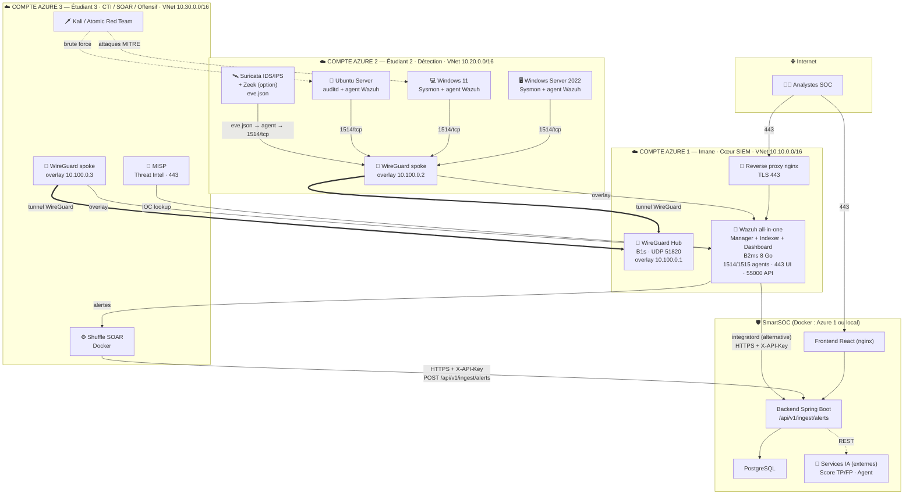

# Architecture du SOC sur Azure — SmartSOC Enterprise

> Conception d'architecte SOC senior. Cible : un SOC **réaliste et crédible
> devant un jury de PFE**, réalisable avec **3 abonnements Azure for
> Students** (crédit ~100 $ chacun, quotas vCPU limités), connecté à la
> plateforme SmartSOC par les **contrats d'intégration** de l'[ADR-005](../adr/ADR-005-standalone-platform-integration-contracts.md).

## 1. Principe directeur

Le SOC et la plateforme SmartSOC sont **développés séparément** puis
**connectés par configuration** (ADR-005). Le SOC produit et normalise les
alertes ; il les **pousse** vers SmartSOC via le webhook d'ingestion
(`POST /api/v1/ingest/alerts`, clé d'API). SmartSOC ne déploie ni ne
configure aucun outil SOC.

Trois comptes Azure distincts (un par étudiant, tenants séparés) sont reliés
en **un seul réseau privé logique** par un **overlay VPN WireGuard**
(hub-and-spoke). C'est le choix clé qui rend le SOC « cohérent » sans
Azure VPN Gateway (trop coûteux pour le crédit étudiant).

## 2. Pourquoi chaque composant

| Composant | Rôle | Justification |
| --- | --- | --- |
| **VNet / Subnets / NSG** | Segmentation réseau | Isole SIEM, capteurs, endpoints, red team ; NSG = pare-feu L4 « deny by default ». Base de toute posture défendable. |
| **WireGuard (overlay)** | VPN inter-comptes | Relie 3 tenants Azure en un réseau privé (10.100.0.0/24) ; léger, chiffré, gratuit. Alternative crédible au VPN Gateway payant. |
| **Azure Bastion / accès WG** | Administration | Pas de port 22/RDP exposé sur Internet ; accès admin via bastion ou overlay uniquement. |
| **Wazuh Manager** | Cœur SIEM / XDR | Collecte, décode, corrèle les événements ; moteur de règles + mapping MITRE ATT&CK. Le cerveau du SOC. |
| **Wazuh Indexer** (OpenSearch) | Stockage / recherche | Indexe les événements pour la recherche et le threat hunting. Composant le plus gourmand en RAM. |
| **Wazuh Dashboard** | Visualisation SOC | Console native Wazuh (complémentaire à SmartSOC pour l'analyste SOC). |
| **Suricata** | IDS/IPS réseau | Détection au niveau réseau (signatures Emerging Threats), sortie `eve.json`. Voit ce que les endpoints ne voient pas. |
| **Zeek** (optionnel) | Métadonnées réseau | Logs riches conn/dns/http/ssl pour le threat hunting. Ajouté si les ressources le permettent. |
| **Sysmon** | Télémétrie Windows | Visibilité fine des processus/réseau/registre sur Windows ; indispensable à la détection endpoint. |
| **Windows Server + Windows 11** | Endpoints supervisés | Cibles réalistes (AD/DC + poste utilisateur) générant des logs et subissant les attaques. |
| **Ubuntu Server + agents Linux** | Endpoints supervisés | Service exposé (SSH/web), auditd + FIM ; cible de brute force. |
| **MISP** | Threat Intelligence | Gestion et corrélation d'IOC (feeds ouverts) ; enrichit les alertes Wazuh. |
| **Shuffle** | SOAR | Orchestration et automatisation des réponses ; enrichit puis pousse vers SmartSOC ; actions (email, blocage IP). |
| **Atomic Red Team / Kali** | Simulation d'adversaire | Génère des attaques MITRE réalistes pour **valider** la détection de bout en bout. |
| **Reverse proxy (nginx)** | Exposition contrôlée | TLS + point d'entrée unique pour les consoles ; réduit la surface d'attaque. |
| **SmartSOC (plateforme)** | Console unifiée + IA | Reçoit les alertes normalisées ; dashboard, incidents, score IA TP/FP, agent IA. |

## 3. Diagramme d'architecture



### Plan d'adressage

| Réseau | Plage | Usage |
| --- | --- | --- |
| VNet Azure 1 | `10.10.0.0/16` | Cœur SIEM |
| VNet Azure 2 | `10.20.0.0/16` | Capteurs + endpoints |
| VNet Azure 3 | `10.30.0.0/16` | CTI / SOAR / offensif |
| Overlay WireGuard | `10.100.0.0/24` | Réseau privé logique inter-comptes |

### Ports clés

| Flux | Port | Exposition |
| --- | --- | --- |
| Agents Wazuh → Manager | `1514/tcp` | Overlay uniquement |
| Enrôlement agent | `1515/tcp` | Overlay uniquement |
| API Wazuh | `55000/tcp` | Overlay uniquement |
| Wazuh Dashboard | `443/tcp` | Reverse proxy |
| WireGuard | `51820/udp` | Public (chiffré) |
| MISP / Shuffle | `443/tcp` | Overlay + reverse proxy |
| Ingestion SmartSOC | `443/tcp` | HTTPS + `X-API-Key` |

## 4. Répartition entre les 3 comptes Azure

Le découpage suit la **chaîne de valeur SOC** (détecter → corréler →
répondre), pas une répartition arbitraire. Chaque étudiant possède un
domaine cohérent et peut travailler **en parallèle** dès que le réseau
overlay (Phase 1) est en place.

### Compte 1 — Imane · **Cœur SIEM & Intégration**
- Hub WireGuard (point d'intégration des 3 comptes)
- Wazuh (Manager + Indexer + Dashboard), reverse proxy
- Règles de corrélation, mapping MITRE
- **Intégration Wazuh → SmartSOC** (cohérent avec sa responsabilité plateforme)

> *Pourquoi Imane :* elle porte SmartSOC ; concentrer le SIEM et le point
> d'intégration chez elle minimise les allers-retours inter-équipes sur le
> contrat d'ingestion.

### Compte 2 — Étudiant 2 · **Détection (réseau + endpoints)**
- Suricata (+ Zeek optionnel)
- Windows Server + Windows 11 + Ubuntu (Sysmon, agents Wazuh, auditd)
- Vérification de la remontée des logs vers le SIEM

### Compte 3 — Étudiant 3 · **CTI / SOAR / Offensif**
- MISP (threat intel) + intégration IOC ↔ Wazuh
- Shuffle (SOAR) + workflows d'enrichissement et de réponse
- Kali / Atomic Red Team + scénarios d'attaque de validation

### Comment les 3 forment un seul SOC
1. **Réseau** : chaque spoke (comptes 2 et 3) monte un tunnel WireGuard vers
   le hub (compte 1). Résultat : un réseau `10.100.0.0/24` où toutes les VM
   se voient de façon privée et chiffrée, quels que soient les tenants.
2. **Données** : tous les agents et capteurs pointent vers **un seul** Wazuh
   Manager (compte 1) via l'overlay → une seule source de corrélation.
3. **Réponse** : Shuffle (compte 3) et MISP (compte 3) dialoguent avec ce
   Manager, puis Shuffle pousse vers **une seule** plateforme SmartSOC.
4. **Contrat** : le seul couplage avec SmartSOC est le webhook d'ingestion
   (clé d'API + schéma OpenAPI publié). Changer d'URL = reconfiguration, pas
   de code.

## 5. Roadmap (phases à dépendances strictes)

| Phase | Contenu | Dépend de | Responsable(s) |
| --- | --- | --- | --- |
| **0 · Préparation** | 3 comptes Azure, RG, alertes budget, même région, quotas vCPU | — | Tous |
| **1 · Réseau** | VNets/subnets/NSG + **overlay WireGuard** (hub + 2 spokes) | Phase 0 | Tous (hub: Imane) |
| **2 · SIEM** | Wazuh all-in-one, durcissement, reverse proxy | Phase 1 | Imane |
| **3 · Endpoints** | Windows/Linux + Sysmon + agents → enrôlés dans Wazuh | Phase 2 | Étudiant 2 |
| **4 · Détection** | Suricata + règles ; attaquant + scénarios de test | Phase 3 | Ét. 2 (capteur) + Ét. 3 (attaque) |
| **5 · CTI / SOAR** | MISP + Shuffle opérationnels | Phase 2 | Étudiant 3 |
| **6 · Intégration** | Wazuh/Shuffle → SmartSOC ; MISP ↔ Wazuh ; validation bout-en-bout | Phases 4 + 5 | Imane + Étudiant 3 |
| **7 · IA** | Score TP/FP + agent IA branchés sur SmartSOC | Phase 6 | Équipe IA |

Le chemin critique est **0 → 1 → 2 → 3 → 4 → 6**. Les phases 5 (CTI/SOAR) et
les endpoints (3) avancent **en parallèle** dès que la Phase 2 (Wazuh) est
debout.

## 6. Flux d'intégration complet SOC → SmartSOC

```
Sources de logs (Windows Sysmon, Linux auditd, trafic réseau)
        ↓
Suricata (IDS/IPS réseau)  +  Agents Wazuh (endpoints)
        ↓   (overlay WireGuard, 1514/tcp)
Wazuh Manager  → décodage, règles de corrélation, mapping MITRE ATT&CK
        ↓
Enrichissement  →  MISP (IOC)  ·  Shuffle (SOAR : VirusTotal, contexte)
        ↓   (HTTPS + X-API-Key)
SmartSOC — POST /api/v1/ingest/alerts  (idempotent, déduplication)
        ↓
Dashboard temps réel (WebSocket)  →  Triage des alertes
        ↓
Incidents (corrélation, timeline, escalade)
        ↓
IA — Score TP/FP (réduction des faux positifs)  ·  Agent (analyse, résumé, remédiation)
```

## 7. Contraintes Azure for Students — recommandations d'architecte

Ces points sont **décisifs** pour que le projet tienne dans le crédit et les
quotas ; ils font partie de l'architecture, pas de simples astuces.

- **Répartir la charge sur 3 abonnements** : chaque compte a son propre quota
  vCPU (souvent ~4–10). Séparer SIEM / endpoints / CTI évite de saturer un
  seul quota.
- **Dimensionnement** : privilégier les VM **B-series burstable** (B1s, B2s,
  B2ms). Wazuh (indexer OpenSearch) est le poste mémoire : **B2ms 8 Go**
  minimum en all-in-one. Endpoints : B1s/B2s.
- **Éteindre (deallocate) les VM inutilisées** : le crédit n'est consommé que
  VM allumée. Une procédure d'arrêt/démarrage disciplinée peut tripler la
  durée de vie du crédit. Prévoir un script d'automatisation.
- **Pas de VPN Gateway** (~27 $/mois) : l'overlay WireGuard sur B1s coûte une
  fraction et se justifie très bien devant un jury.
- **Disques** : Standard SSD/HDD suffisent ; disque data dédié pour l'indexer.
- **Budgets + alertes de coût obligatoires** dès la Phase 0 sur chaque compte.

## 8. Évolution vers une meilleure architecture (si ressources disponibles)

Si le crédit et les quotas le permettent, la version « professionnelle
étendue » de cette architecture :
- **Séparer** Wazuh Indexer sur sa propre VM (compte 1) pour un vrai cluster.
- Ajouter **Zeek** en production (pas seulement optionnel) pour le hunting.
- Ajouter un **FleetDM + osquery** pour l'inventaire et le hunting endpoint.
- **Sigma** pour porter des règles de détection standardisées vers Wazuh.

Ces extensions sont documentées comme *nice-to-have* : l'architecture de base
ci-dessus reste le socle défendable et réalisable.
